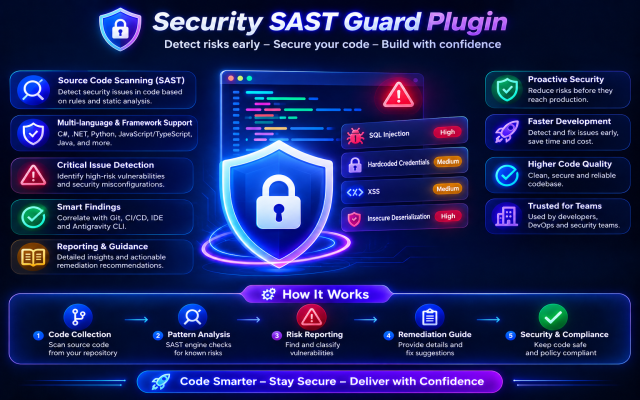
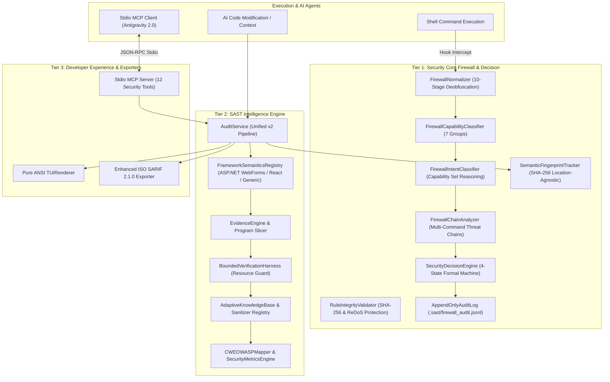

<div align="center">



# 🛡️ SECURITY SAST GUARD PLUGIN
**Zero-Trust Enterprise SAST & Real-time Command Firewall Engine**
*Engineered for Google Antigravity 2.0 & Gemini CLI Ecosystems*

[](https://github.com/nguyenduydan/security-sast-guard-plugin/actions/workflows/ci.yml)
[](https://github.com/nguyenduydan/security-sast-guard-plugin/actions/workflows/codeql.yml)
[](https://github.com/nguyenduydan/security-sast-guard-plugin/actions/workflows/release.yml)
[](https://github.com/nguyenduydan/security-sast-guard-plugin/releases)
[](https://www.python.org/)
[](https://github.com/astral-sh/ruff)
[](https://mypy-lang.org/)
[-violet.svg)](#-stdio-mcp-server-integration)
[](CODE_OF_CONDUCT.md)
[](LICENSE)
[](CONTRIBUTING.md)

[⚡ Quick Start](#-quick-start) • [🗺️ Roadmap](docs/ROADMAP.md) • [📚 Project Wiki](docs/wiki/Home.md) • [🧠 Architecture](docs/ARCHITECTURE.md) • [🛡️ Security Model](docs/SECURITY_MODEL.md) • [🔌 MCP Server](#-stdio-mcp-server-integration) • [🎮 Slash Commands & CLI](#-slash-commands--cli-reference) • [🛡️ Security Vectors](#-security-vectors--rule-coverage) • [🔄 CI/CD & Release](#-cicd-workflow--quality-gates)

</div>

---

## ⚡ Quick Start

### Windows (PowerShell)
```powershell
# Install Security SAST Guard Plugin
Invoke-WebRequest -Uri "https://raw.githubusercontent.com/nguyenduydan/security-sast-guard-plugin/main/install.ps1" -OutFile "install.ps1"
.\install.ps1

# Update (Preserves local .sast/profile.json configuration)
cd $HOME\.gemini\config\plugins\security-sast-guard; .\update.ps1

# Uninstall
cd $HOME\.gemini\config\plugins\security-sast-guard; .\remove.ps1
```

### Linux & macOS (POSIX Shell)
```bash
# Install Security SAST Guard Plugin
curl -fsSL https://raw.githubusercontent.com/nguyenduydan/security-sast-guard-plugin/main/install.sh -o install.sh
chmod +x install.sh && ./install.sh

# Update (Preserves local .sast/profile.json configuration)
cd ~/.gemini/config/plugins/security-sast-guard && ./update.sh

# Uninstall
cd ~/.gemini/config/plugins/security-sast-guard && ./remove.sh
```

---

## 🧠 Architecture & 13 Modular Subsystems

Security SAST Guard introduces a symbiotic AI-agent security architecture combining a **10-Stage Command Interception Firewall** with an **Intelligence-Driven SAST Engine**.



### Breakdown of the 13 Core Modules

| Module Name | Tier | Core Responsibility & Architectural Role |
| :--- | :---: | :--- |
| **1. FirewallNormalizer** | Security Core | 10-stage command deobfuscation (Caret/Backtick, Base64, Hex/Unicode escape, Env vars, Interpolation, Char codes, Aliases, Subcommands, Decomposition). |
| **2. FirewallCapabilityClassifier** | Security Core | Maps deobfuscated commands across 7 capability groups (`NETWORK`, `FILE_READ`, `FILE_WRITE`, `PROCESS_EXEC`, `PRIVILEGE_CHANGE`, `PERSISTENCE`, `DATA_TRANSFER`). |
| **3. FirewallIntentClassifier** | Security Core | Reasons intent from capability sets (`EXFILTRATION`, `DESTRUCTIVE`, `PERSISTENCE`, `PRIVILEGE_ESCALATION`, `SUPPLY_CHAIN`, `LATERAL_MOVEMENT`). |
| **4. FirewallChainAnalyzer** | Security Core | Detects hazardous multi-command execution chains (e.g. `Download+Execute`, execution policy bypass, unverified script invocation). |
| **5. SecurityDecisionEngine** | Security Core | Formal 4-state decision machine (`TRUE_POSITIVE`, `FALSE_POSITIVE`, `CONFIRM_REQUIRED`, `NOT_ENOUGH_CONTEXT`) with weighted risk scoring & policy overrides. |
| **6. SemanticFingerprintTracker** | Security Core | Generates line-agnostic SHA-256 finding signatures to maintain baseline state across refactorings; detects tamper (T7). |
| **7. RuleIntegrityValidator** | Security Core | Verifies SHA-256 rule definitions integrity (T5) and detects Catastrophic Backtracking (ReDoS) patterns in rule regexes. |
| **8. AppendOnlyAuditLog** | Security Core | Cryptographically chained, append-only JSONL log (`.sast/firewall_audit.jsonl`) verifying full execution auditability. |
| **9. EvidenceEngine** | SAST Intelligence | Extracts `EvidenceGraph` nodes (`source`, `propagation`, `sanitizer`, `sink`) and computes minimal relevant Program Slices. |
| **10. BoundedVerificationHarness** | SAST Intelligence | Enforces resource limits on AI verification loops (max 5 iterations, 10 tool calls, 30s timeout, 1MB output, 20 files, 128MB RAM). |
| **11. AdaptiveKnowledgeBase** | SAST Intelligence | Sanitizer governance registry with mandatory Human/Policy approval gate and cryptographic provenance hashes. |
| **12. CWEOWASPMapper & Metrics** | SAST Intelligence | Maps findings to CWE IDs and OWASP Top 10 categories; calculates Precision, Recall, F1 Score, FPR, FNR, and Critical Recall metrics. |
| **13. FrameworkSemanticsRegistry**| SAST Intelligence | Multi-language framework strategy plugin framework supporting ASP.NET WebForms (`<asp:TextBox>`, `<%: %>`), React, and Generic fallbacks. |

---

## 🔌 Stdio MCP Server Integration

Add `sast-guard` to your project or global `mcp_config.json`:

```json
{
  "mcpServers": {
    "sast-guard": {
      "command": "python",
      "args": ["-m", "src.mcp.server"],
      "cwd": "${workspaceFolder}"
    }
  }
}
```

### Complete Stdio MCP Tools Suite (12 Tools)

| Stdio MCP Tool Name | Primary Purpose | Key Arguments & Input Schema | Output / Response Format |
| :--- | :--- | :--- | :--- |
| `sast_scan_file` | Audits single file with taint traces | `file_path` (string) | JSON findings array, taint traces & summary |
| `sast_scan_diff` | Incremental Git diff security audit | None | Audit summary of modified lines & findings |
| `sast_check_command` | Validates shell command safety | `command` (string) | Firewall verdict (`ALLOW`, `CONFIRM`, `DENY`), risk score |
| `sast_get_status` | Returns profile & system status | None | Active level, mode, rule counts, deny/confirm lists |
| `sast_set_mode` | Switches strictness mode | `mode` (`"strict"` \| `"draft"`) | Confirmation status & mode applied |
| `sast_set_level` | Adjusts inspection audit depth | `level` (`"lite"` \| `"full"` \| `"ultra"`) | Confirmation & active rule scope |
| `sast_init` | Initializes local project config | None | Path to created `.sast/profile.json` |
| `sast_sync_rules` | Synchronizes security rules | `rules_dir` (optional string) | Synced rule count & validation status |
| `sast_get_help` | Fetches command & rule guidance | None | Slash commands list & vector coverage map |
| `sast_get_dataflow_path` | Traces source-to-sink dataflows | `source_pattern`, `sink_pattern`, `repo_path` | Structured dataflow path nodes & line numbers |
| `sast_get_taint_context` | Retrieves code context for taint line | `file_path`, `line_number`, `context_lines` | Code snippet block with line annotations |
| `sast_generate_report` | Generates SARIF / Markdown report | `findings`, `target_path`, `ai_analysis` | Path to generated `.sarif` and `.md` reports |

---

## 🖥️ Pure ANSI TUI & SARIF 2.1.0 Exporter

### Pure ANSI TUI Renderer
Built with zero external dependencies (pure Python ANSI codes), providing crisp terminal rendering:
- Dynamic Version Header resolved dynamically via `get_plugin_version()`.
- Interactive Real-time Scan Progress bars with file counters.
- Rich Boxed Finding Cards featuring code snippets, CWE/OWASP tags, and remediation guidance.
- Distinctly styled Firewall Verdict boxes: **`DENY`** (Red), **`CONFIRM`** (Yellow), **`ALLOW`** (Green).

### Enhanced SARIF 2.1.0 Report Exporter
Generates standard ISO SARIF 2.1.0 artifacts compatible with GitHub Code Scanning, SonarQube, and CI pipelines:
- Full taxonomy tags for **CWE** (e.g. `CWE-79`, `CWE-89`) and **OWASP Top 10** (`A03:2021-Injection`).
- Embedded SHA-256 semantic fingerprints for issue tracking across commits.
- Precise `threadFlows` and `location` graphs mapping dataflow propagation from source to sink.

---

## 🎮 Slash Commands & CLI Reference

### Slash Commands & CLI Commands Matrix

| Slash Command | CLI Command | Description |
| :--- | :--- | :--- |
| 🛡️ `/sast-audit [type] [path]` | `sast scan [path]` | Runs security audit (`folder`, `file`, `diff`, `codebase`, `api`, `web`). |
| 🤖 `/sast-audit --ai [path]` | `sast ai-triage [path]` | Runs SAST audit + Agentic AI root-cause analysis via Google Antigravity SDK. |
| 📊 `/sast-status` | `sast status` | Displays active profile, audit level, mode, and loaded rule count. |
| 🚀 `/sast-init` | `sast init` | Creates local `.sast/profile.json` security configuration. |
| 🎛️ `/sast-mode [strict\|draft]` | `sast mode [mode]` | `strict` enforces zero high/critical tolerance; `draft` logs only. |
| 🎚️ `/sast-audit-level [lite\|full\|ultra]` | `sast level [level]` | Configures scanning depth (`lite`: fast regex, `full`: AST, `ultra`: Taint). |
| 🛠️ `/sast-rules [sync\|add]` | `sast rules` | Synchronizes rule directory or validates custom `.md` rule specs. |
| 🧱 `/sast-firewall [command]` | `sast firewall [cmd]` | Checks command safety against 10-stage normalizer (`ALLOW`, `CONFIRM`, `DENY`). |
| 🆘 `/sast-help` | `sast help` | Displays quick command reference and security vectors guide. |

### Extended CLI Flags
- `-a` / `--ai`: Activates **Google Antigravity AI Security Advisor** for root-cause triage & remediation advice.
- `--json <file_path>` / `--format json`: Exports scan findings as machine-readable structured JSON.
- `-v` / `--verbose`: Enables verbose debug trace output for deep inspection.

---

## 🤖 Google Antigravity SDK Integration (`google-antigravity`)

Security SAST Guard embeds the **Google Antigravity Python SDK** as an optional extra (`[ai]`) to provide non-intrusive, zero-trust AI root-cause triage directly within your IDE:

```bash
# Install with optional AI Agent triage support
pip install -e ".[ai]"
```

### 🌟 Key Agentic AI Highlights
1. **Local Zero-Cost Execution:** Leverages active Google Antigravity IDE / CLI login quotas — **zero extra API keys or fees required**.
2. **Deterministic SHA-256 Cache:** Previously analyzed code snippets are served instantly with **0 tokens consumed**.
3. **Token Accounting Telemetry:** Reports exact `Input`, `Thinking`, `Output`, and `Total Tokens` consumed.
4. **Zero-Trust Hardening:** Hardcoded `CapabilitiesConfig(disabled_tools=["run_command", "edit_file", "create_file", "start_subagent"])` prevents prompt injection attacks from modifying your workspace.
5. **Graceful Fallback:** If `google-antigravity` is not installed or running offline, the tool automatically falls back to 100% heuristic static analysis without crashing.


---

## 📁 Custom Exclusions & Blacklist Configuration

Security SAST Guard automatically ignores built-in build caches, `.git`, dependencies (`node_modules`, `.venv`, `vendor`), and lock files.

To customize scan exclusions for your repository, use either of the following:

### 1. Standalone `blacklist.json` (Recommended)
Place `blacklist.json` at your project root or in `.sast/blacklist.json`:
```json
[
  "tests/fixtures/*",
  "legacy_module/",
  "generated_*.py",
  "*.min.js",
  "mock_data.json"
]
```

### 2. Standard `.sastignore`
Create a `.sastignore` file at your repository root with glob patterns:
```gitignore
# Ignore test fixtures and temporary generated files
tests/fixtures/*
build_artifacts/
*.tmp
```

## 🛡️ Security Vectors & Rule Coverage

Security SAST Guard implements **95 core SAST vector rules** mapped across major enterprise standards:

| Framework / Category | Rule Count | High-Impact Vector Examples |
| :--- | :---: | :--- |
| **OWASP Web Application Top 10** | 28 | Broken Access Control (A01), Cryptographic Failure (A02), Injection (A03), Deserialization RCE (A08) |
| **Web Application Specific Rules** | 29 | DOM XSS, Inline Event Handlers, SQLi Variants, SSTI, Unsafe File Upload |
| **OWASP API Security Top 10** | 27 | BOLA (API1), Broken Auth (API2), Mass Assignment (API3), SSRF (API7) |
| **OWASP LLM 2025 Top 10** | 3 | Prompt Injection (LLM01), Sensitive Information Disclosure (LLM02), Excessive Agency (LLM06) |
| **CI/CD & Container Security** | 4 | GitHub Actions Expression Injection, Unsafe Checkout, Docker Root Execution |
| **CWE-SANS & NIST 800-53** | 4 | OS Command Injection (CWE-78), Path Traversal (CWE-22), Audit Events |

### Inline Suppression Syntax
To suppress specific rule alerts on a target line, append `# sast-ignore [RULE_ID]`:
```python
query = f"SELECT * FROM users WHERE id = {user_id}"  # sast-ignore [OWASP-A03-SQLI]
```

---

## 🔄 CI/CD Workflow & Quality Gates

Security SAST Guard enforces strict pre-commit and automated release workflows via GitHub Actions:

- **CI Workflow (`.github/workflows/ci.yml`):** Runs on all Pull Requests and pushes to `main`.
  1. **Ruff Format & Linting:** Enforces PEP 8 and formatting standards (`ruff check .` & `ruff format --check .`).
  2. **Pylint Quality Gate:** Verifies core code quality (`pylint control_plane.py src/`).
  3. **MyPy Type Checking:** Ensures strict static typing (`mypy --config-file=pyproject.toml control_plane.py src/`).
  4. **Pytest Suite:** Runs 100% passing test coverage (`pytest`).
- **Release Workflow (`.github/workflows/release.yml`):** Managed automatically by `release-please` v4. Automatically drafts PRs, bumps versions, updates `CHANGELOG.md`, and creates tagged GitHub Releases upon merge.

---

## 📚 Enterprise Project Wiki

Explore the full enterprise-grade documentation suite in [`docs/wiki/`](docs/wiki/Home.md):

| Wiki Module | Focus Area & Description | Direct Link |
| :--- | :--- | :---: |
| 🏠 **Home & Quick Start** | System overview, two-tier Zero-Trust defense model, 1-Click Installer for PowerShell & POSIX Bash | [`Home.md`](docs/wiki/Home.md) |
| 🧠 **Architecture & Security Model** | 10-Stage Deobfuscation, Threat Chains, AST Engine, Taint Tracking, Shannon Entropy | [`Architecture-and-Security-Model.md`](docs/wiki/Architecture-and-Security-Model.md) |
| 🎮 **CLI & Slash Commands** | Complete reference for 8 AI Agent Slash Commands, CLI syntax, Blacklist & Exclusions | [`CLI-and-Slash-Commands.md`](docs/wiki/CLI-and-Slash-Commands.md) |
| 🔌 **MCP Server Integration** | 12 Stdio MCP Tools specifications, connection setup for Antigravity 2.0, Gemini CLI, Claude, Cursor | [`MCP-Server-Integration.md`](docs/wiki/MCP-Server-Integration.md) |
| 🛡️ **Rule Engine & Taxonomy** | 95 Security Vectors, OWASP/CWE/NIST mappings, `# sast-ignore` inline syntax, Markdown sync | [`Rule-Engine-and-Taxonomy.md`](docs/wiki/Rule-Engine-and-Taxonomy.md) |
| 🔄 **CI/CD & Quality Gates** | ISO SARIF 2.1.0 export for GitHub Security, 4 CI Quality Gates, Conventional Commits, Release Please v4 | [`CI-CD-and-Quality-Gates.md`](docs/wiki/CI-CD-and-Quality-Gates.md) |

---

## 🤝 Contributing & License

Distributed under the [MIT License](LICENSE). See [CONTRIBUTING.md](CONTRIBUTING.md) and [docs/RELEASE_GUIDE.md](docs/RELEASE_GUIDE.md) for contribution & release guidelines.
