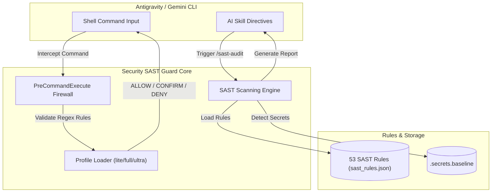

<div align="center">

# 🛡️ Security SAST Guard Plugin

**Enterprise Static Application Security Testing (SAST) & Real-time Command Firewall Guard**  
*Built for Google Antigravity & Gemini CLI Ecosystems*

[](https://github.com/nguyenduydan/security-sast-guard-plugin/actions/workflows/ci.yml)
[](https://github.com/nguyenduydan/security-sast-guard-plugin/actions/workflows/release.yml)
[](https://www.python.org/)
[](LICENSE)
[](https://github.com/astral-sh/ruff)
[](https://mypy-lang.org/)

[Features](#-key-features) • [Architecture](#-architecture-overview) • [Quick Start](#-quick-start) • [Slash Commands](#-slash-commands-reference) • [Rules Summary](#-sast-rules-coverage) • [Contributing](#-contributing)

</div>

## 📖 About Security SAST Guard

**Security SAST Guard** is your automated security co-pilot for Google Antigravity & Gemini CLI. You don't need to be a cybersecurity expert to use it—it works behind the scenes to keep your computer safe and ensure the code written by AI is completely free of security flaws and hidden bugs.

---

## ❓ What Makes It Essential For You?

### 🛡️ 1. Is It Safe? (Command Firewall Protection)
**Yes, 100%.** When you give AI full access to your terminal, one wrong command could delete your files or format your drive. Security SAST Guard acts as a real-time shield:
- 🛑 **Automatic Danger Block:** Hard-blocks destructive commands (`rm -rf`, `format C:`, registry edits, or malicious remote script downloads) before they execute.
- ⚠️ **High-Risk Confirmation:** Forces explicit human approval for actions that alter code history (`Remove-Item`, `git push --force`, `del`).

### 🔍 2. How Deeply Can It Scan? (53 Security Vulnerability Scenarios)
It checks every line of code written by AI against **53 international security standards** (OWASP Top 10, OWASP API 2023, CWE Top 25, NIST 800-53):
- **Database Hacks (SQL Injection):** Prevents attackers from stealing or deleting database records.
- **API Security Vulnerabilities:** Catches broken authentication, authorization bypasses (BOLA), and unauthorized API access.
- **Secret & API Key Protection:** Instantly stops passwords, Private Keys, or API tokens from leaking onto GitHub.
- **Remote Code Execution (RCE) & Injection:** Blocks malicious inputs from executing commands on your server.

### 🌟 3. What Value Do You Get?
- 🚀 **Peace of Mind with Full AI Autonomy:** Enable AI tools with 100% confidence knowing your machine and codebase are bulletproof.
- 💎 **Clean, Senior-Grade Code:** Ensures AI-generated code is clean, PEP8 compliant, strictly typed, and completely error-free.
- 🤫 **Silent & Fast:** Operates seamlessly in the background without cluttering your chat UI with raw command text.

---

| Feature / Protection Scope | Native Antigravity Permissions | Security SAST Guard Plugin |
| :--- | :---: | :---: |
| **Tool & Resource Access Control** | ✅ Native Access Control | ➖ Relies on Native Harness |
| **Deep Command Inspection (Regex Firewall)** | ❌ Binary Allow/Deny | ✅ **`ALLOW` / `CONFIRM` / `DENY` Regex Inspection** |
| **Destructive Command Blocking (`rm -rf`, `format`)** | ❌ Allowed if Terminal Granted | ✅ **Automatic Hard Block (DENY)** |
| **High-Risk Command Guard (`Remove-Item`, `git push --force`)** | ❌ Allowed if Terminal Granted | ⚠️ **Mandatory User Confirmation (CONFIRM)** |
| **Code Vulnerability Auditing (OWASP/CWE/NIST)** | ❌ No Code Analysis | 🔍 **53 SAST Rules Scanning Engine** |
| **API Keys & Secret Leakage Prevention** | ❌ No Secret Scanning | 🔒 **Detect-Secrets Baseline Enforcement** |
| **Automated CI/CD Quality Gate & Linting** | ❌ No Code Formatting | 🚦 **Ruff, Mypy Strict, Pylint 10/10, Pytest** |

---

## ✨ Key Features

- 🔒 **Real-Time Command Firewall:** Intercepts terminal executions via `PreCommandExecute` hook to evaluate safety (`ALLOW` | `CONFIRM` | `DENY`), preventing accidental file destruction (`rm -rf`, `format`), registry mutation, or remote script execution (`curl | bash`, `Invoke-Expression`).
- 🔍 **53 Security SAST Rules:** Out-of-the-box static analysis rules mapping directly to **OWASP Top 10**, **OWASP API Security 2023**, **CWE-SANS Top 25**, and **NIST 800-53**.
- ⚡ **Silent AI Skill Execution:** Intelligent prompt directives that run background verification scripts cleanly without polluting the user chat UI.
- 🚦 **Enterprise Pre-Commit System:** 14-stage automated pre-commit sanitation equipped with **Ruff** (linting + formatting), **Mypy** (strict typing), **Pytest**, and **Detect-Secrets**.
- 📦 **Automated Release Please Pipeline:** Automated SemVer versioning, changelog compilation, and GitHub Release publication using `release-please-action`.

---

## 🏗️ Architecture Overview



---

## 🚀 Quick Start

### Prerequisites
- **Python:** `>= 3.12`
- **Git:** `>= 2.30`
- **CLI Ecosystem:** Google Antigravity CLI or Gemini CLI

### Installation & Setup

1. **Clone the Repository:**
   ```bash
   git clone https://github.com/nguyenduydan/security-sast-guard-plugin.git
   cd security-sast-guard-plugin
   ```

2. **Install Development Dependencies:**
   ```bash
   pip install pre-commit ruff mypy pytest detect-secrets pylint
   ```

3. **Enable Pre-Commit Git Hooks:**
   ```bash
   # Enable pre-commit hook (runs linting & type checks before commit)
   pre-commit install

   # Enable commit-msg hook (enforces Conventional Commits format)
   pre-commit install --hook-type commit-msg
   ```

4. **Verify Environment Readiness:**
   ```bash
   python -m ruff check .
   python -m mypy --config-file=pyproject.toml control_plane.py src/
   python -m pytest
   ```

---

## 🎮 Slash Commands Reference

| Slash Command | Syntax | Description |
| :--- | :--- | :--- |
| `/sast-audit` | `/sast-audit <file\|codebase\|api\|web> <path>` | Triggers static vulnerability audit. Runs single file synchronously or codebase audits silently in the background. |
| `/sast-audit-level` | `/sast-audit-level [lite\|full\|ultra]` | Sets or views active audit strictness (`lite`: Critical only, `full`: OWASP Top10, `ultra`: All + CWE/NIST). |
| `/sast-rules` | `/sast-rules <add\|sync> <path>` | Converts Markdown rule files into compiled JSON pattern definitions. |
| `/sast-firewall` | `/sast-firewall <command>` | Manually tests a shell command against the Firewall overlay rules (`ALLOW` / `CONFIRM` / `DENY`). |
| `/sast-status` | `/sast-status` | Displays security profile card, loaded rule counts, and deny/confirm pattern statistics. |
| `/sast-help` | `/sast-help` | Displays quick reference cheatsheet for SAST Guard plugin options. |

---

## 📊 SAST Rules Coverage

| Category | Count | Example Coverage |
| :--- | :---: | :--- |
| **OWASP API Security 2023** | 10 | BOLA (API1), Broken Auth (API2), Mass Assignment (API3), SSRF (API7) |
| **OWASP Web Application 2021** | 10 | Access Control (A01), Cryptographic Failures (A02), Injection (A03) |
| **Web App Specific** | 11 | Race Condition (WEB10), Source File Exposure (WEB11), CORS (WEB9) |
| **CWE-SANS Top 25** | 12 | SQLi (CWE-89), XSS (CWE-79), Command Injection (CWE-77), RCE |
| **NIST 800-53 Security Controls** | 10 | AC-2 (Account Management), SC-8 (Transmission Integrity), AU-2 (Audit Events) |

---

## 🌳 Repository Structure

```
security-sast-guard/
├── .github/
│   ├── ISSUE_TEMPLATE/       # Bug report & Feature request templates
│   ├── workflows/            # CI Quality Gate (ci.yml) & Release Please (release.yml)
│   ├── CODEOWNERS            # Codeownership declaration
│   ├── PULL_REQUEST_TEMPLATE.md
│   └── SECURITY.md           # Security disclosure policy
├── docs/
│   ├── releases/             # Formal release reports (v0.0.1, v1.1.0-beta.1...)
│   ├── RELEASE_GUIDE.md      # Deployment & Release management standard
│   └── RULE_TEMPLATE.md      # Custom SAST rule creation guide
├── rules/
│   ├── sast_rules.json       # 53 compiled SAST rules
│   └── profiles.json         # Firewall deny & confirm pattern overlays
├── skills/                   # AI Prompt Directives for silent background execution
├── src/
│   ├── cli/                  # Command line dispatcher
│   ├── domain/               # Core SAST Scanner & Firewall logic
│   └── infrastructure/       # Profile loader & Execution logger
├── tests/                    # Unit & Integration test suite
├── .editorconfig             # Unified IDE formatting standard
├── .pre-commit-config.yaml   # 14-stage automated pre-commit pipeline
├── .secrets.baseline         # Detect-secrets baseline file
├── pyproject.toml            # Ruff, Mypy & Pytest configurations
├── release-please-config.json # Release Please changelog section mappings
├── .release-please-manifest.json
├── LICENSE                   # MIT License
└── README.md
```

---

## 🤝 Contributing

We welcome community contributions! Please read our [CONTRIBUTING.md](CONTRIBUTING.md) guide before submitting Pull Requests.

1. Fork the repo and create your feature branch: `git checkout -b feat/my-new-rule`.
2. Follow Conventional Commits format for your commit messages.
3. Ensure all CI quality checks pass: `pre-commit run --all-files`.
4. Open a Pull Request using our PR template.

---

## 📄 License

Distributed under the **MIT License**. See [`LICENSE`](LICENSE) for details.
