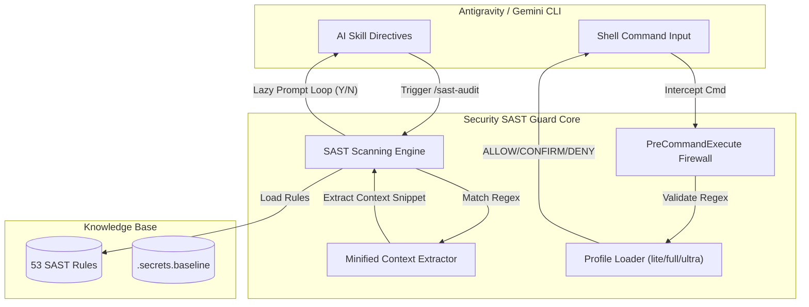

<div align="center">


# 🛡️ SECURITY SAST GUARD PLUGIN
**Zero-Trust Enterprise SAST & Real-time Command Firewall**
*Engineered for Google Antigravity & Gemini CLI Ecosystems*

[](https://github.com/nguyenduydan/security-sast-guard-plugin/actions/workflows/ci.yml)
[](https://github.com/nguyenduydan/security-sast-guard-plugin/actions/workflows/release.yml)
[](https://www.python.org/)
[](LICENSE)
[](#)
[](#)

[🔥 Features](#-core-security-features) • [🧠 Architecture](#-architecture-overview) • [⚡ Installation](#-installation--lifecycle-management) • [🎮 Commands](#-slash-commands-reference) • [🛡️ Rules](#-sast-rules-coverage) • [🤝 Contributing](#-contributing)

</div>

---

## 🕵️‍♂️ About Security SAST Guard

**Security SAST Guard** is your automated, zero-trust security co-pilot for Google Antigravity & Gemini CLI. You don't need to be a cybersecurity expert to use it—it works stealthily behind the scenes to keep your local machine safe and ensures the code generated by AI is completely free of security flaws, CVEs, and hidden injection vectors.

> *"Empower your AI without compromising your system's integrity."*

---

## 🚨 Why You Need This

When you give AI full autonomous access to your terminal, one hallucinated command could delete your files, wipe your database, or expose your private keys. **Security SAST Guard** acts as an unbreakable real-time shield:

### 🛑 1. Real-Time Command Firewall
- **Zero-Trust Hard Block:** Instantly blocks destructive commands (`rm -rf`, `format C:`, unauthorized registry edits, or malicious remote script downloads) **before** they execute.
- **High-Risk Interception:** Forces explicit human approval for actions that alter code history or system states (`Remove-Item`, `git push --force`, `del`).

### ☢️ 2. Deep Static Code Analysis (53 Security Vectors)
It meticulously checks every line of code written by AI against **53 international security standards** (OWASP Top 10, OWASP API 2023, CWE Top 25, NIST 800-53):
- **Injection Defense:** Prevents SQLi, NoSQLi, and OS Command Injections.
- **API & Cloud Security:** Catches broken authentication, authorization bypasses (BOLA), and Server-Side Request Forgery (SSRF).
- **Secret Protection:** Instantly stops passwords, RSA Private Keys, or API tokens from leaking into your commits.

### 💎 3. Clean, Enterprise-Grade Output
- 🚀 **Peace of Mind:** Enable fully autonomous AI agents with 100% confidence.
- 🧹 **Strict Linting:** Ensures AI-generated code is perfectly PEP8 compliant, strictly typed, and error-free via our aggressive CI/CD gates.
- 🤫 **Silent Execution:** Operates seamlessly in the background via Lazy Interactive Prompts without polluting your chat UI.

---

## ⚡ Installation & Lifecycle Management

We provide a streamlined, automated suite of PowerShell scripts allowing you to install, update, and remove the plugin without touching Git or manually copying files.

> **Note:** Run these scripts directly in your PowerShell terminal.

### 📥 1. Install
Automatically fetches the latest `.zip` release from GitHub, extracts it, and sets up the plugin in your Antigravity environment.
```powershell
Invoke-WebRequest -Uri "https://raw.githubusercontent.com/nguyenduydan/security-sast-guard-plugin/main/install.ps1" -OutFile "install.ps1"
.\install.ps1
```

### 🔄 2. Update
Updates the plugin to the newest version while **automatically backing up and restoring your user configuration** (`profile.json`). Simply run it from the installed directory:
```powershell
cd $HOME\.gemini\config\plugins\security-sast-guard
.\update.ps1
```

### 🗑️ 3. Remove
Safely uninstalls the plugin and its data from your system.
```powershell
cd $HOME\.gemini\config\plugins\security-sast-guard
.\remove.ps1
```

> 🛠️ **Developer Note:** Looking to contribute or modify SAST rules locally? Check out the developer setup guide in [CONTRIBUTING.md](CONTRIBUTING.md).

---

## 🔥 Core Security Features

- 🔒 **`PreCommandExecute` Interceptor:** Hooks directly into the CLI lifecycle to evaluate command safety (`ALLOW` | `CONFIRM` | `DENY`).
- 🔍 **Interactive Lazy Prompt Loop:** Extracts only the suspicious code context around a potential vulnerability to save AI token space, halting execution to ask for your confirmation.
- ⚡ **Silent AI Skill Directives:** Intelligent prompt skills that run background verification scripts cleanly.
- 🚦 **14-Stage Pre-Commit Gate:** Automated pre-commit sanitation equipped with **Ruff** (linting + formatting), **Mypy** (strict typing), **Pytest** (100% Coverage), and **Detect-Secrets**.

---

## 🧠 Architecture Overview



---

## 🎮 Slash Commands & CLI Reference

### 🤖 AI Slash Commands (Chat UI)

| Slash Command | Syntax | Description |
| :--- | :--- | :--- |
| 🛡️ `/sast-audit` | `/sast-audit <file\|codebase\|api\|web> <path>` | Triggers static vulnerability audit. Runs synchronously for files or silently in the background for codebases. |
| 🎚️ `/sast-audit-level`| `/sast-audit-level [lite\|full\|ultra]` | Sets active audit strictness (`lite`: Critical, `full`: OWASP Top10, `ultra`: All + CWE/NIST). |
| ⚙️ `/sast-rules` | `/sast-rules <add\|sync> <path>` | Converts Markdown rule files into compiled JSON pattern definitions. |
| 🧱 `/sast-firewall` | `/sast-firewall <command>` | Manually tests a shell command against the Firewall overlay rules. |
| 📊 `/sast-status` | `/sast-status` | Displays security profile card, loaded rule counts, and pattern statistics. |
| 🆘 `/sast-help` | `/sast-help` | Displays quick reference cheatsheet for SAST Guard plugin options. |

### 💻 CLI Directives (Terminal Entrypoint)

| CLI Subcommand | Syntax | Description |
| :--- | :--- | :--- |
| 📊 `status` | `python control_plane.py status` | Displays profile status, checksum integrity, and active SAST rules. |
| ℹ️ `version` | `python control_plane.py version` | Displays plugin version (`v0.10.1`), Python runtime, and platform info. |
| 🧱 `firewall` | `python control_plane.py firewall <command>` | Evaluates command against firewall rules (`ALLOW` \| `CONFIRM` \| `DENY`). |
| 🎚️ `level` | `python control_plane.py level [lite\|full\|ultra]` | Displays or updates active SAST audit strictness level. |
| 🔍 `scan` | `python control_plane.py scan [path]` | Scans target path and generates Markdown vulnerability audit report. |

---

## 🛡️ SAST Rules Coverage

Security SAST Guard is shipped with 53 battle-tested rules mapping to top cybersecurity frameworks:

| Threat Category | Count | Coverage Examples |
| :--- | :---: | :--- |
| **OWASP API Security 2023** | 10 | BOLA (API1), Broken Auth (API2), Mass Assignment (API3), SSRF (API7) |
| **OWASP Web Application 2021** | 10 | Access Control (A01), Cryptographic Failures (A02), Injection (A03) |
| **Web App Specific** | 11 | Race Condition (WEB10), Source File Exposure (WEB11), CORS (WEB9) |
| **CWE-SANS Top 25** | 12 | SQLi (CWE-89), XSS (CWE-79), Command Injection (CWE-77), RCE |
| **NIST 800-53 Controls** | 10 | AC-2 (Account Management), SC-8 (Transmission Integrity), AU-2 (Audit Events) |

---

## 🤝 Contributing

We welcome security researchers and community contributors! Please read our [CONTRIBUTING.md](CONTRIBUTING.md) guide before submitting Pull Requests.

1. Fork the repo and create your feature branch: `git checkout -b feat/my-new-rule`.
2. Follow Conventional Commits format for your commit messages.
3. Ensure all CI quality checks pass: `pre-commit run --all-files`.
4. Open a Pull Request using our template.

---

<div align="center">
  <b>Protected by Security SAST Guard</b><br>
  Distributed under the <a href="LICENSE">MIT License</a>.
</div>
