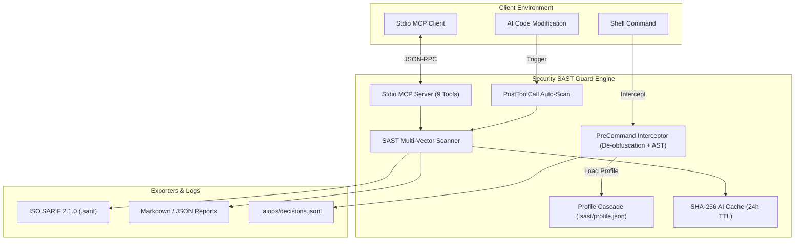

<div align="center">


# 🛡️ SECURITY SAST GUARD PLUGIN
**Zero-Trust Enterprise SAST & Real-time Command Firewall**
*Engineered for Google Antigravity 2.0 & Gemini CLI Ecosystems*

[](https://github.com/nguyenduydan/security-sast-guard-plugin/actions/workflows/ci.yml)
[](https://github.com/nguyenduydan/security-sast-guard-plugin/actions/workflows/release.yml)
[](https://github.com/nguyenduydan/security-sast-guard-plugin/releases)
[](https://www.python.org/)
[](#-stdio-mcp-server-integration)
[](LICENSE)

[⚡ Quick Start](#-quick-start) • [🧠 Architecture](#-architecture-overview) • [🔌 MCP Server](#-stdio-mcp-server-integration) • [🎮 Reference](#-slash-commands--cli-reference) • [🛡️ Security Vectors](#-security-vectors--rule-coverage)

</div>

---

## ⚡ Quick Start

```powershell
# Install Security SAST Guard
Invoke-WebRequest -Uri "https://raw.githubusercontent.com/nguyenduydan/security-sast-guard-plugin/main/install.ps1" -OutFile "install.ps1"
.\install.ps1

# Update (Preserves local .sast/profile.json)
cd $HOME\.gemini\config\plugins\security-sast-guard; .\update.ps1

# Uninstall
cd $HOME\.gemini\config\plugins\security-sast-guard; .\remove.ps1
```

---

## 🧠 Architecture Overview

Security SAST Guard provides a two-tier zero-trust defense line: **Command Execution Firewall** (pre-execution shell interception) and **Static Application Security Testing (SAST) Scanning Engine** (file audit & MCP integration).



---

## 🔌 Stdio MCP Server Integration

Add `sast-guard` to your `mcp_config.json`:

```json
{
  "mcpServers": {
    "sast-guard": {
      "command": "python",
      "args": ["-m", "src.mcp.server"],
      "cwd": "${workspaceFolder}"
    }
  }
}
```

### Stdio Tools Provided
- `sast_scan_file`: Audits single source code file against active SAST rules.
- `sast_scan_diff`: Performs incremental scan against Git diff tracking branch.
- `sast_check_command`: Validates shell command against Firewall safety rules.
- `sast_get_status` / `sast_set_mode` / `sast_set_level` / `sast_init` / `sast_sync_rules` / `sast_get_help`.

---

## 🎮 Slash Commands & CLI Reference

| AI Slash Command | CLI Command | Function |
| :--- | :--- | :--- |
| 🛡️ `/sast-audit [type] [path]` | `sast scan [path]` | Triggers SAST audit (`diff`, `file`, `codebase`, `api`, `web`). |
| 📊 `/sast-status` | `sast status` | Displays profile configuration, active mode, and rule count. |
| 🚀 `/sast-init` | `sast init` | Initializes project-level `.sast/profile.json` config. |
| 🎛️ `/sast-mode [strict\|draft]` | `sast mode [mode]` | Sets operation strictness (`strict` blocks warnings, `draft` logs only). |
| 🎚️ `/sast-audit-level [lite\|full\|ultra]` | `sast level [level]` | Updates inspection depth (`lite`, `full`, `ultra`). |
| 🛠️ `/sast-rules [sync\|add]` | `sast rules` | Syncs or definition-updates SAST security vector rules. |

---

## 🛡️ Security Vectors & Rule Coverage

Security SAST Guard implements **53 core SAST vector rules** mapped across global standard frameworks:

| Framework / Category | Rule Count | High-Impact Vector Examples |
| :--- | :---: | :--- |
| **OWASP API Security 2023** | 10 | BOLA (API1), Broken Authentication (API2), Mass Assignment (API3), SSRF (API7) |
| **OWASP Web Application Top 10** | 10 | Broken Access Control (A01), Cryptographic Failure (A02), Injection (A03) |
| **CWE-SANS Top 25** | 12 | SQLi (CWE-89), XSS (CWE-79), OS Command Injection (CWE-78), Path Traversal (CWE-22) |
| **NIST 800-53 Security Controls** | 10 | AC-2 Account Management, SC-8 Transmission Integrity, AU-2 Audit Events |
| **Secret & Credential Guard** | 11 | Hardcoded RSA/SSH Keys, API Tokens, Plaintext Password Assignment |

### Inline Suppression
To suppress specific rule alerts in source code, append `# sast-ignore [RULE_ID]` to the target line:
```python
query = f"SELECT * FROM users WHERE id = {user_id}"  # sast-ignore [OWASP-A03-SQLI]
```

---

## 🤝 Contributing & License

Distributed under the [MIT License](LICENSE). Read [CONTRIBUTING.md](CONTRIBUTING.md) for details on submitting security rule additions.

