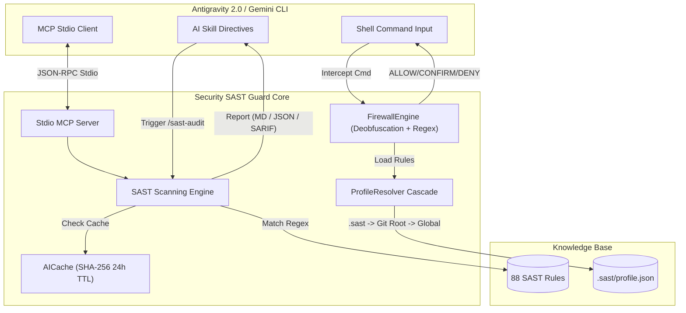

<div align="center">


# 🛡️ SECURITY SAST GUARD PLUGIN
**Zero-Trust Enterprise SAST & Real-time Command Firewall**
*Engineered for Google Antigravity 2.0 & Gemini CLI Ecosystems*

[](https://github.com/nguyenduydan/security-sast-guard-plugin/actions/workflows/ci.yml)
[](https://github.com/nguyenduydan/security-sast-guard-plugin/actions/workflows/release.yml)
[](https://github.com/nguyenduydan/security-sast-guard-plugin/releases)
[](https://www.python.org/)
[](#-antigravity-20-stdio-mcp-server)
[](LICENSE)

[🔥 Features](#-core-security-features) • [🧠 Architecture](#-architecture-overview) • [🔌 MCP Integration](#-antigravity-20-stdio-mcp-server) • [⚡ Installation](#-installation--lifecycle-management) • [🎮 Commands](#-slash-commands--cli-reference) • [🛡️ Rules](#-sast-rules-coverage) • [🤝 Contributing](#-contributing)

</div>

---

## 🕵️‍♂️ About Security SAST Guard

**Security SAST Guard** is an automated, zero-trust security co-pilot for Google Antigravity & Gemini CLI environments. It operates continuously in the background to protect your host system from destructive shell commands while performing static application security testing (SAST) on source code against OWASP, CWE, and NIST frameworks.

---

## 🔥 Core Security Features

### 🌐 1. Real-Time Command Firewall & Anti-Bypass Deobfuscation
- **Anti-Bypass Engine:** Intercepts, de-obfuscates (strips carets `c^m^d`, PowerShell backticks ``c`m`d``), and decodes Base64 shell payloads (`cm0gLXJmIC8=` -> `rm -rf /`).
- **Cross-Platform Hooks:** Native bash (`hooks/firewall_hook.sh`) and PowerShell hooks for Linux, macOS, and Windows.
- **PostToolCall Auto-Scan:** `PostToolCallExecute` hook (`hooks/post_write_hook.py`) automatically audits files generated or edited by AI agents.

### 🔌 2. Native Stdio MCP Server & SARIF Exporter
- **Stdio MCP Server:** Exposes 8 JSON-RPC tools (`sast_scan_file`, `sast_scan_diff`, `sast_check_command`, etc.) for IDE integration.
- **SARIF 2.1.0 Exporter:** Generates ISO-standard `reports/*.sarif` reports for GitHub Code Scanning and IDE vulnerability highlighting.

### 🗂️ 3. Multi-Project Profile Resolver & Custom Rule Sync
- **Cascade Priority:** Resolves configuration order: `.sast/profile.json` (CWD) ➔ `.sast/profile.json` (Git Root) ➔ Global `profile.json`.
- **Smart Git Base Resolver:** Automatically resolves tracking remote HEAD / `origin/main` / `origin/master` for incremental `sast_scan_diff`.

### 🤖 4. AI Response Cache (SHA-256) & Dual Report Formats
- **SHA-256 Cache:** Local cache (`~/.sast/ai_cache.json`) with 24h TTL eliminates redundant LLM verification calls.
- **Multi-Format Output:** Generates Markdown (`.md`), JSON (`.json`), and SARIF (`.sarif`) audit reports.

### 🎨 5. Cyber TUI & Interactive Landing Page
- **PowerShell Cyber TUI:** Interactive installation, update, and removal scripts (`install.ps1`, `update.ps1`, `remove.ps1`).
- **Web Dashboard:** Interactive [`docs/index.html`](docs/index.html) landing page with live workflow animations and security rules explorer.

### 🌳 6. Dual-Guard Real-Time AST Engine & Remediation Snippets
- **Dual-Guard AST Node Scope:** Categorizes code into `html-inline-event`, `html-attribute`, `client-js-regex`, and `server-code` (Python, C#, ASP.NET WebForms, Node.js, Java, PHP).
- **Inline Comment Suppression:** Supports `# sast-ignore [RULE_ID]`, `# sast-disable`, and `# sast-enable`.
- **Remediation Code Snippets:** Reports include structured code diffs showing vulnerable patterns (`fix_before`) vs secure defense (`fix_after`).

---

## ⚡ Installation & Lifecycle Management

```powershell
# Install
Invoke-WebRequest -Uri "https://raw.githubusercontent.com/nguyenduydan/security-sast-guard-plugin/main/install.ps1" -OutFile "install.ps1"
.\install.ps1

# Update (Backs up & restores profile.json)
cd $HOME\.gemini\config\plugins\security-sast-guard
.\update.ps1

# Remove
cd $HOME\.gemini\config\plugins\security-sast-guard
.\remove.ps1
```

---

## 🧠 Architecture Overview



---

## 🔌 Antigravity 2.0 Stdio MCP Server

Add to your `mcp_config.json`:

```json
{
  "mcpServers": {
    "sast-guard": {
      "command": "python",
      "args": ["-m", "src.mcp.server"],
      "cwd": "${workspaceFolder}"
    }
  }
}
```

---

## 🎮 Slash Commands & CLI Reference

### 🤖 AI Slash Commands
| Slash Command | Syntax | Description |
| :--- | :--- | :--- |
| 🛡️ `/sast-audit` | `/sast-audit [type] [path]` | Triggers static audit (`diff`, `file`, `codebase`, `api`, `web`). Omit params for Grill UI modal. |
| 📊 `/sast-status` | `/sast-status` | Displays plugin status, operation mode, and active rules count. |
| 🚀 `/sast-init` | `/sast-init` | Initializes project-local `.sast/profile.json` security profile. |
| 🎛️ `/sast-mode` | `/sast-mode [strict\|draft]` | Toggles operation mode (`strict` \| `draft`). |
| 🎚️ `/sast-audit-level`| `/sast-audit-level [lite\|full\|ultra]` | Sets audit strictness (`lite`, `full`, `ultra`). |
| 🛠️ `/sast-rules` | `/sast-rules [sync\|add\|status]` | Manages SAST rule definitions. |

### 💻 CLI Subcommands
| CLI Subcommand | Syntax | Description |
| :--- | :--- | :--- |
| 📊 `status` | `sast status` | Displays plugin status and active rule counts. |
| 🎛️ `mode` | `sast mode [strict\|draft]` | Sets operation mode (`strict` \| `draft`). |
| ℹ️ `version` | `sast version` | Displays plugin version and runtime info. |
| 🧱 `firewall` | `sast firewall <command>` | Evaluates command against firewall rules. |
| 🚀 `init` | `sast init` | Creates project-local `.sast/profile.json`. |
| 🔌 `mcp-server` | `sast mcp-server` | Runs Stdio JSON-RPC MCP Server. |
| 🎚️ `level` | `sast level [lite\|full\|ultra]` | Updates active audit strictness level. |
| 🔍 `scan` | `sast scan [path] [--format json]` | Scans target path and generates report. |

---

## 🛡️ SAST Rules Coverage

Security SAST Guard ships with **88 battle-tested rules** mapping to international security frameworks:

| Threat Category | Count | Coverage Examples |
| :--- | :---: | :--- |
| **OWASP API Security 2023** | 10 | BOLA (API1), Broken Auth (API2), Mass Assignment (API3), SSRF (API7) |
| **OWASP Web Application 2021** | 10 | Access Control (A01), Cryptographic Failures (A02), Injection (A03) |
| **Web App Specific** | 11 | Race Condition (WEB10), Source File Exposure (WEB11), CORS (WEB9) |
| **CWE-SANS Top 25** | 12 | SQLi (CWE-89), XSS (CWE-79), Command Injection (CWE-078), Path Traversal (CWE-022) |
| **NIST 800-53 Controls** | 10 | AC-2 (Account Management), SC-8 (Transmission Integrity), AU-2 (Audit Events) |
| **ASP.NET & WebForms Security** | 35 | WebForms Event Handlers, Data-Binding Sanitization, ViewState Protection |

---

## 🤝 Contributing

Please read our [CONTRIBUTING.md](CONTRIBUTING.md) guide before submitting Pull Requests.

---

<div align="center">
  <b>Protected by Security SAST Guard</b><br>
  Distributed under the <a href="LICENSE">MIT License</a>.
</div>
