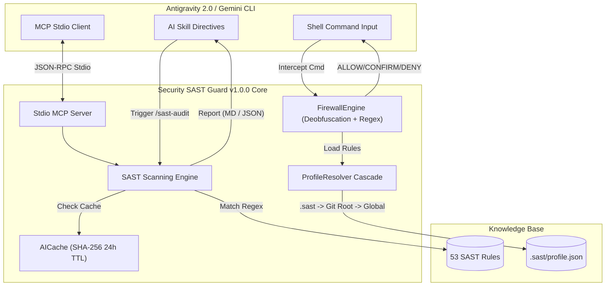

<div align="center">


# 🛡️ SECURITY SAST GUARD PLUGIN
**Zero-Trust Enterprise SAST & Real-time Command Firewall (v1.0.0)**
*Engineered for Google Antigravity 2.0 & Gemini CLI Ecosystems*

[](https://github.com/nguyenduydan/security-sast-guard-plugin/actions/workflows/ci.yml)
[](https://github.com/nguyenduydan/security-sast-guard-plugin/actions/workflows/release.yml)
[](https://github.com/nguyenduydan/security-sast-guard-plugin/releases/tag/v1.0.0)
[](https://www.python.org/)
[](#-antigravity-20-stdio-mcp-server)
[](LICENSE)

[🔥 Features](#-core-security-features) • [🧠 Architecture](#-architecture-overview) • [🔌 MCP Integration](#-antigravity-20-stdio-mcp-server) • [⚡ Installation](#-installation--lifecycle-management) • [🎮 Commands](#-slash-commands--cli-reference) • [🛡️ Rules](#-sast-rules-coverage) • [🤝 Contributing](#-contributing)

</div>

---

## 🕵️‍♂️ About Security SAST Guard

**Security SAST Guard v1.0.0** is your automated, zero-trust security co-pilot for Google Antigravity & Gemini CLI. It works stealthily behind the scenes to keep your local machine safe from destructive shell commands, while auditing AI-generated code against OWASP and CWE standards in real-time.

> *"Empower your AI without compromising your system's integrity."*

---

## 🚨 What's New in v1.0.0 Major Release

### 🌐 1. Pure Python Cross-Platform FirewallEngine & Auto-Hooks
- **Anti-Bypass Deobfuscation:** Detects and strips caret obfuscation (`c^m^d`), PowerShell backticks (``c`m`d``), and automatically decodes Base64 payloads (`cm0gLXJmIC8=` -> `rm -rf /`).
- **Cross-Platform Compatibility:** Native POSIX bash (`hooks/firewall_hook.sh`) and Windows PowerShell launcher supporting Linux, macOS, and Windows.
- **PostToolCall Auto-Scan Hook:** `PostToolCallExecute` hook (`hooks/post_write_hook.py`) automatically audits files written or modified by AI agents.

### 🔌 2. Native Stdio MCP Server for Antigravity 2.0
Exposes 5 Stdio JSON-RPC MCP tools for seamless IDE integration:
1. **`sast_scan_file(file_path)`**: Audits target source file for vulnerabilities.
2. **`sast_scan_diff()`**: Scans uncommitted git changes in the workspace.
3. **`sast_check_command(command)`**: Evaluates shell command safety (`ALLOW` | `CONFIRM` | `DENY`).
4. **`sast_get_status()`**: Retrieves loaded profile status, rule counts, and strictness level.
5. **`sast_set_level(level)`**: Updates active audit level (`lite`, `full`, `ultra`).

### 🗂️ 3. Multi-Project Profile Resolver & `/sast-init`
- **Priority Cascade Resolution:** Loads profile settings in order: `.sast/profile.json` (CWD) ➔ `.sast/profile.json` (Git Root) ➔ Global Plugin `profile.json`.
- **Project Initialization:** Slash command `/sast-init` (or `python control_plane.py init`) generates project-specific security rules.

### 🤖 4. AI Response Cache (SHA-256) & Dual Report Formats
- **SHA-256 Cache:** Local cache (`~/.sast/ai_cache.json`) with 24h TTL eliminates redundant LLM verification calls.
- **Dual Output Formats:** Supports both Markdown (`.md`) and JSON (`.json`) report generation (`--format json`).

### 🎨 5. Cyber / Neo-Brutalist TUI & Interactive Docs Site
- **PowerShell Cyber TUI:** `install.ps1`, `update.ps1`, and `remove.ps1` feature Cyber/Neo-Brutalist ASCII headers, block progress bars (`[████████░░░]`), and UTF-8 BOM encoding for perfect encoding compatibility.
- **Interactive Landing Page:** Updated [`docs/index.html`](docs/index.html) with separate CSS/JS assets ([`docs/style/style.css`](docs/style/style.css), [`docs/style/app.js`](docs/style/app.js)), live 5-step workflow animation, and 53 SAST rules explorer.

---

## ⚡ Installation & Lifecycle Management

We provide an automated, Cyber-TUI PowerShell suite to install, update, and remove the plugin smoothly.

> **Note:** Run these scripts directly in your PowerShell terminal.

### 📥 1. Install
Fetches the latest `v1.0.0` release from GitHub, extracts it, and registers the plugin in your Antigravity environment.
```powershell
Invoke-WebRequest -Uri "https://raw.githubusercontent.com/nguyenduydan/security-sast-guard-plugin/main/install.ps1" -OutFile "install.ps1"
.\install.ps1
```

### 🔄 2. Update
Updates the plugin while **automatically backing up and restoring your user profile** (`profile.json`):
```powershell
cd $HOME\.gemini\config\plugins\security-sast-guard
.\update.ps1
```

### 🗑️ 3. Remove
Safely uninstalls the plugin and restores original configuration states:
```powershell
cd $HOME\.gemini\config\plugins\security-sast-guard
.\remove.ps1
```

---

## 🧠 Architecture Overview



---

## 🔌 Antigravity 2.0 Stdio MCP Server

To enable Security SAST Guard inside **Antigravity 2.0 (IDE)** or any MCP-compatible environment, add the following configuration to your `mcp_config.json`:

```json
{
  "mcpServers": {
    "sast-guard": {
      "command": "python",
      "args": ["-m", "src.mcp.server"],
      "cwd": "${workspaceFolder}"
    }
  }
}
```

For complete integration details and tool schemas, read [`docs/MCP_INTEGRATION.md`](docs/MCP_INTEGRATION.md).

---

## 🎮 Slash Commands & CLI Reference

### 🤖 AI Slash Commands (Chat UI)

| Slash Command | Syntax | Description |
| :--- | :--- | :--- |
| 🛡️ `/sast-audit` | `/sast-audit <file\|codebase\|api\|web> <path>` | Triggers static vulnerability audit. Outputs Markdown and JSON reports. |
| 🚀 `/sast-init` | `/sast-init` | Initializes project-local `.sast/profile.json` security profile. |
| 🎚️ `/sast-audit-level`| `/sast-audit-level [lite\|full\|ultra]` | Sets active audit strictness (`lite`: Critical, `full`: OWASP Top10, `ultra`: All + CWE/NIST). |
| ⚙️ `/sast-rules` | `/sast-rules <add\|sync> <path>` | Compiles Markdown rule definitions into JSON pattern rules. |
| 🧱 `/sast-firewall` | `/sast-firewall <command>` | Evaluates shell command against Firewall rules (`ALLOW` \| `CONFIRM` \| `DENY`). |
| 📊 `/sast-status` | `/sast-status` | Displays profile status card, loaded rule counts, and checksum integrity. |
| 🆘 `/sast-help` | `/sast-help` | Displays quick reference cheatsheet for SAST Guard options. |

### 💻 CLI Subcommands (Terminal Entrypoint)

| CLI Subcommand | Syntax | Description |
| :--- | :--- | :--- |
| 📊 `status` | `python control_plane.py status` | Displays profile status, checksum integrity, and active SAST rules. |
| ℹ️ `version` | `python control_plane.py version` | Displays plugin version (`v1.0.0`), Python runtime, and platform info. |
| 🧱 `firewall` | `python control_plane.py firewall <command>` | Evaluates command against firewall rules with de-obfuscation. |
| 🚀 `init` | `python control_plane.py init` | Creates project-local `.sast/profile.json` template. |
| 🔌 `mcp-server` | `python control_plane.py mcp-server` | Runs Stdio JSON-RPC MCP Server for IDEs. |
| 🎚️ `level` | `python control_plane.py level [lite\|full\|ultra]` | Updates active SAST audit strictness level. |
| 🔍 `scan` | `python control_plane.py scan [path] [--format json]` | Scans target path and generates audit report. |

---

## 🛡️ SAST Rules Coverage

Security SAST Guard ships with 53 battle-tested rules mapping to top international frameworks:

| Threat Category | Count | Coverage Examples |
| :--- | :---: | :--- |
| **OWASP API Security 2023** | 10 | BOLA (API1), Broken Auth (API2), Mass Assignment (API3), SSRF (API7) |
| **OWASP Web Application 2021** | 10 | Access Control (A01), Cryptographic Failures (A02), Injection (A03) |
| **Web App Specific** | 11 | Race Condition (WEB10), Source File Exposure (WEB11), CORS (WEB9) |
| **CWE-SANS Top 25** | 12 | SQLi (CWE-89), XSS (CWE-79), Command Injection (CWE-078), Path Traversal (CWE-022) |
| **NIST 800-53 Controls** | 10 | AC-2 (Account Management), SC-8 (Transmission Integrity), AU-2 (Audit Events) |

---

## 🤝 Contributing

We welcome security researchers and community contributors! Please read our [CONTRIBUTING.md](CONTRIBUTING.md) guide before submitting Pull Requests.

1. Fork the repo and create your feature branch: `git checkout -b feat/my-new-rule`.
2. Follow Conventional Commits format for your commit messages.
3. Ensure all CI quality checks pass: `pytest` and `pylint`.
4. Open a Pull Request using our template.

---

<div align="center">
  <b>Protected by Security SAST Guard v1.0.0</b><br>
  Distributed under the <a href="LICENSE">MIT License</a>.
</div>
