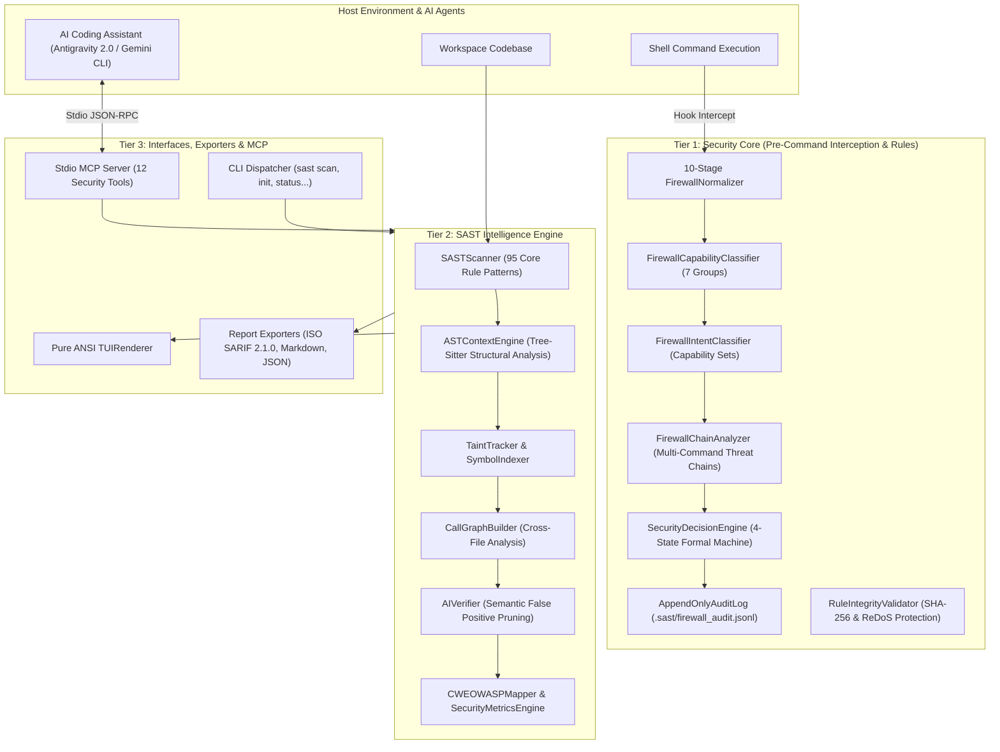

# 🧠 Security SAST Guard — Deep Architecture Specification

Security SAST Guard provides a **Zero-Trust Symbiotic AI Security Architecture** designed for AI coding assistants (Google Antigravity 2.0, Gemini CLI) and autonomous agent workflows.

---

## 🏛️ 3-Tier Layered Architecture



---

## 🛡️ Tier 1: Security Core & Command Firewall

The **Command Interception Firewall** operates synchronously via the `PreCommandExecute` hook, inspecting commands before execution:

1. **10-Stage Deobfuscation Pipeline (`FirewallNormalizer`):**
   - **Stage 1:** Strips caret (`^`) and backtick (`` ` ``) line escape tricks and decodes POSIX octal escapes (`\0NNN`, `\NNN`).
   - **Stage 2:** Decodes Base64 encoded payload wrappers (`-EncodedCommand`, `echo ... | base64 -d`).
   - **Stage 3:** Decodes Hex byte encodings (`\x41`, `0x41`).
   - **Stage 4:** Decodes Unicode escape sequences (`\u0041`).
   - **Stage 5:** Resolves and expands environment variables (`%TEMP%`, `$env:PATH`).
   - **Stage 6:** Normalizes PowerShell string format interpolations (`"{0}{1}" -f ...`).
   - **Stage 7:** Assembles character code expressions (`[char]0x41 + [char]0x42`).
   - **Stage 8:** Expands shell command aliases (`iex` → `Invoke-Expression`, `curl` → `Invoke-WebRequest`).
   - **Stage 9:** Unpacks subshells and command substitution strings (`$(...)`, ```` `...` ````).
   - **Stage 10:** Decomposes composite chains into atomic statement streams (`&&`, `||`, `;`, `|`).

2. **Capability & Intent Reasoning:**
   - Classifies commands across 7 capability groups (`NETWORK`, `FILE_READ`, `FILE_WRITE`, `PROCESS_EXEC`, `PRIVILEGE_CHANGE`, `PERSISTENCE`, `DATA_TRANSFER`).
   - Reasons threat intent (`DESTRUCTIVE`, `EXFILTRATION`, `PRIVILEGE_ESCALATION`, `SUPPLY_CHAIN`).

3. **Cryptographic Auditability:**
   - Logs SHA-256 chained records to `.sast/firewall_audit.jsonl`.

---

## 🔬 Tier 2: SAST Intelligence Engine

1. **Rule Engine & Vector Coverage:**
   - 95 vector rules spanning OWASP Top 10, CWE Top 25, OWASP LLM Top 10 (2025), and CI/CD security.
   - Built-in ReDoS catastrophic backtracking prevention validator.

2. **AST & Structural Context (`ASTContextEngine`):**
   - Modernized `tree-sitter` multi-language parsing.
   - Differentiates client-side DOM manipulation from server-side process execution.

3. **Symbol Indexer & Taint Tracker (`TaintTracker`):**
   - Tracks dataflows from untrusted inputs (`Source`) across intermediate assignments (`Propagation`) to execution points (`Sink`).
   - Supports typed variable definitions in JS/TS, Go, Java, C#, Python, and Kotlin.

4. **False Positive Reduction (`AIVerifier`):**
   - Semantic context window analysis filters out safe constants, sanitized variables, and typecasts.

---

## 🔌 Tier 3: Stdio MCP Server (12 Tools)

The stdio MCP server exposes 12 granular tools for AI agent pair-programming:

| Tool Name | Type | Function |
| :--- | :--- | :--- |
| `sast_scan_file` | Security | Scan single file with taint trace extraction |
| `sast_scan_diff` | Incremental | Scan only modified git diff lines |
| `sast_check_command` | Firewall | Verify shell command safety against firewall |
| `sast_get_status` | Telemetry | Inspect profile mode, level, and active rules |
| `sast_set_level` | Config | Set inspection level (`lite`, `full`, `ultra`) |
| `sast_set_mode` | Config | Toggle operation mode (`strict` vs `draft`) |
| `sast_init` | Setup | Initialize `.sast/profile.json` in workspace |
| `sast_sync_rules` | Rules | Re-sync and validate custom Markdown rules |
| `sast_get_help` | Help | Fetch reference manual and vectors map |
| `sast_get_dataflow_path`| Taint | Trace source-to-sink graph path nodes |
| `sast_get_taint_context` | Code | Extract code snippet surrounding taint line |
| `sast_generate_report` | Export | Generate ISO SARIF 2.1.0, Markdown, or JSON |
