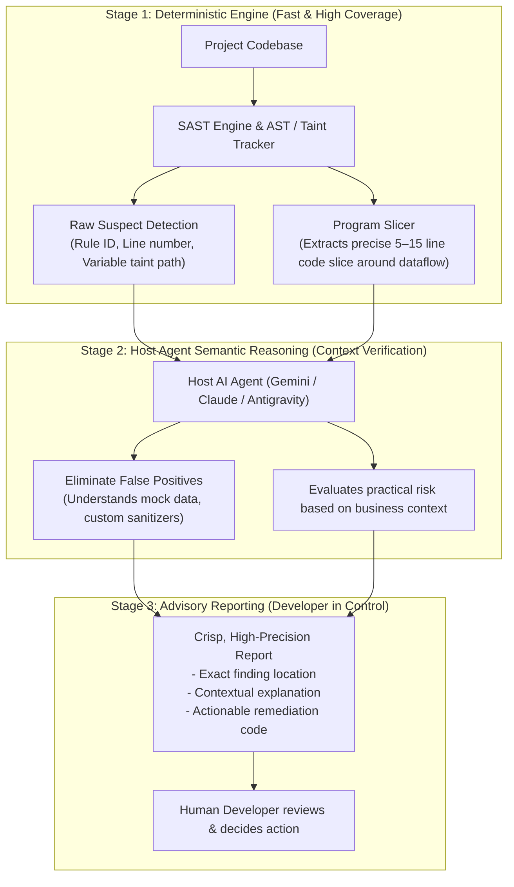
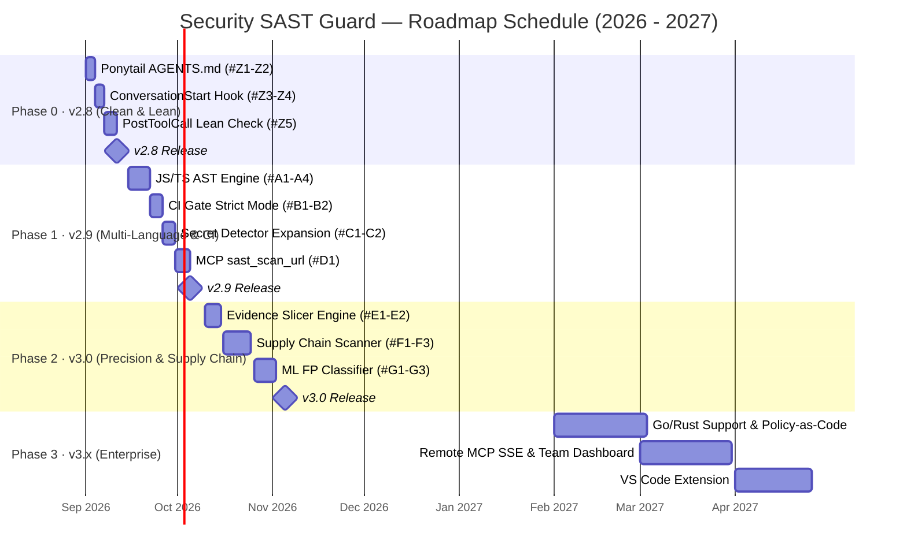

# 🛡️ Security SAST Guard — Product Development Roadmap

> **Current Version:** `v2.7.1` · Python 3.12+ · 95 Security Rules · 12 MCP Tools · 13 Modular Subsystems  
> **Last Updated:** August 2026

---

## 🎯 Ultimate Mission

> **Empowering AI Agents to write Secure, Clean, and Lean Code.**

Modern AI coding agents (Gemini, Claude Code, Antigravity, Cursor) often introduce three primary categories of code debt: security vulnerabilities, dead/dirty boilerplate, and over-engineered abstractions. Security SAST Guard unites **Zero-Trust SAST Security Engine** with **Lean Senior Developer Principles (Ponytail)** to address all three pillars:

| Core Pillar | Problem Solved | Current Status | Strategic Approach |
|:---:|:---|:---:|:---|
| 🛡️ **Secure** | OWASP/CWE vulnerabilities, command injection, secret leakage, supply-chain risks | ✅ Production | SAST Guard Engine (Firewall + AST Scanner + Taint Tracker) |
| 🧹 **Clean** | Dead code, silent exception swallowing (`except: pass`), anti-patterns, code smells | ⚠️ Planned | Integrated Ponytail (Clean Code Audits & Post-Write Linting) |
| ✂️ **Lean** | YAGNI violations, premature abstractions, speculative interfaces, bloated diffs | ⚠️ Planned | Integrated Ponytail (Session Start Guidance & Mindset) |

---

## 💡 Two-Stage Hybrid Architecture (Tool + AI Agent Symbiosis)

> **Deterministic Tool Scans Raw Code & Slices Evidence ➔ Semantic Host Agent Verifies Context ➔ High-Precision Advisory Report to Developer.**

### Key Architectural Strengths:
1. **Engine does what static tools do best:** Sub-millisecond parsing across thousands of lines, tracking AST scopes, building call graphs, and extracting precise program slices.
2. **AI does what language models do best:** Reads the focused code slice with natural language comprehension, eliminating false alarms without scanning blind directories.
3. **Developer receives maximum signal, zero noise:** No alert fatigue, zero intrusive code overwriting, just clean actionable advisory reports.

---

## 💡 Operating Philosophy: Advisory & Report-First (Developer in Control)

1. **Non-Intrusive by Design:**
   - The tool **never silently modifies, reformats, or alters project code** without explicit developer instruction.
   - Core purpose: Detect risks, provide context, and propose concise `Remediation Hints`.
2. **Developer Holds 100% Decision Authority:**
   - Developers choose whether to apply proposed fixes, ignore alerts for deliberate architectural choices, or mark `# sast-ignore [RULE_ID]`.
   - Built-in feedback mechanism (`sast fp mark`) continuously refines baseline precision.
3. **Zero-Overhead (No Local LLM Required):**
   - Seamlessly leverages the active Host Agent (Gemini/Claude/Antigravity), requiring zero auxiliary local LLM servers (no Ollama/GGUF RAM/GPU overhead).

---

## 📍 Baseline Overview — What's in v2.7.1

| Subsystem | Components in v2.7.1 | State |
|:---|:---|:---:|
| **Firewall** | `FirewallNormalizer` (10 deobf stages), `CapabilityClassifier`, `IntentClassifier`, `ChainAnalyzer`, `DecisionEngine` | ✅ Production |
| **SAST Engine** | `SASTScanner` (Parallel), `ShannonEntropyDetector`, `ASTContextEngine`, `ASTPrecisionAnalyzer` | ✅ Production |
| **Taint Tracking** | `TaintTracker`, `CallGraphBuilder`, `SymbolIndexer`, `ASTConfirmEngine` | ✅ Production |
| **AI Verification & Triage** | `AntigravitySecurityAdvisor` (Google Antigravity SDK), `AICache` (SHA-256), Adaptive Batching, Token Telemetry | ✅ Production |

| **Frameworks** | `DotNetWebForms`, `Generic`, `React` (Rule-level) | ⚠️ Limited |
| **MCP Server** | 12 Stdio Tools (JSON-RPC) | ✅ Production |
| **Exporters** | ISO SARIF 2.1.0, Markdown, JSON, Pure ANSI TUI, HTML Dashboard | ✅ Production |
| **CI/CD** | GitHub Actions (Ruff, Pylint, MyPy Strict, Pytest, CodeQL) | ✅ Production |

---

## 🗂️ Phase 0 — `v2.8` · Ponytail Integration & Session Start Context
**Target Date:** September 2026 · ~1–2 weeks

### 🎯 Objectives
Embed the **Ponytail** lean philosophy directly into Security SAST Guard to establish the "Clean & Lean" mindset at the start of every AI conversation session.

---

### 📦 Milestone 0.1 — Automatic Session Context Injection (`AGENTS.md`)

#### Issue `#Z1` — Create Unified `AGENTS.md` (Ponytail + Security Directives)
- **Goal:** Standardized instruction file auto-loaded by Gemini CLI / Antigravity at conversation start.
- **Contents:**
  1. 7-Rung Ponytail Ladder (YAGNI → Code Reuse → Stdlib → Native Platform → One-Liner → Minimal Diff).
  2. Zero-Trust Security Checklist (eval/exec bans, SQL parameterization, secret hygiene).
  3. AI Agent Session Start Checklist.
- **Effort:** S (1 day)

#### Issue `#Z2` — Configure `gemini-extension.json` with `contextFileName`
- **Goal:** Declare `"contextFileName": "AGENTS.md"` in `gemini-extension.json` for automatic environment pick-up.
- **Effort:** XS (0.5 day)

---

### 📦 Milestone 0.2 — Session Start Orientation & Post-Write Hooks

#### Issue `#Z3` — Lightweight `hooks/conversation_start_hook.py`
- **Goal:** Sub-second session hook:
  1. Verifies `.sast/profile.json` status.
  2. Inspects `git diff --stat` to give the Agent instant context on dirty files.
  3. Outputs brief reminder: `"✂️ Ponytail Mode ON — YAGNI first, stdlib second, write last."`
- **Effort:** S (1 day)

#### Issue `#Z4` — Register `ConversationStart` Hook in `hooks.json`
- **Goal:** Register configuration entry in `hooks.json`.
- **Effort:** XS (0.5 day)

#### Issue `#Z5` — Lean & Clean Advisory Output in `post_write_hook.py`
- **Goal:** After AI file edits (`PostToolCallExecute`), output non-blocking advisory warnings for:
  - Unused / Dead functions.
  - Silent exception swallowing (`except: pass`).
  - Single-method classes / speculative abstractions.
- **Effort:** M (2 days)

---

## 🗂️ Phase 1 — `v2.9` · Multi-Language AST & DevSecOps CI Gate
**Target Date:** October 2026 · ~3–4 weeks

### 🎯 Objectives
Expand AST-aware precision analysis to JavaScript/TypeScript and provide strict CI pipeline gating (`--ci`) for automated Pull Request scanning.

---

### 📦 Milestone 1.1 — JavaScript / TypeScript AST Engine

#### Issue `#A1` — Integrate `tree-sitter-javascript` / `tree-sitter-typescript`
- **New File:** `src/domain/frameworks/javascript.py`
- **Scope:** `JavaScriptFrameworkStrategy` implementing source, sink, and sanitizer node extraction for Node.js and Browser environments.
- **Effort:** M (3 days)

#### Issue `#A2` — Type-Aware Taint Suppression for TypeScript
- **Modified File:** `src/domain/taint_tracker.py`
- **Scope:** Recognize safe type casting (`as string`, `as number`) to suppress false alarms.
- **Effort:** S (1 day)

#### Issue `#A3` — Add `target_languages` Metadata to Rule Engine
- **Modified Files:** `rules/docs/*.md`, `scripts/md_to_json.py`, `src/domain/sast_scanner.py`
- **Scope:** Scope rules specifically to target extensions (`python`, `javascript`, `typescript`).
- **Effort:** M (2 days)

---

### 📦 Milestone 1.2 — DevSecOps CI Quality Gate

#### Issue `#B1` — Strict `--ci` Flag with Non-Zero Exit Code
- **Modified File:** `src/cli/dispatcher.py`
- **Scope:** Exit with code `1` when `Critical` or `High` findings are detected under `--ci`.
- **Effort:** XS (0.5 day)

#### Issue `#B2` — Integrate `--ci` Step into GitHub Actions Workflow
- **Modified File:** `.github/workflows/ci.yml`
- **Scope:** Automated PR check outputting SARIF annotations.
- **Effort:** XS (0.5 day)

---

### 📦 Milestone 1.3 — Provider Secret Detector Expansion

#### Issue `#C1` — Add 8 Provider Token Signatures to `entropy_detector.py`
- **Additions:** Anthropic (`sk-ant-`), Google API (`AIza`), Azure SAS, Slack, Twilio, SendGrid, HashiCorp Vault, Docker Hub.
- **Effort:** S (1 day)

#### Issue `#C2` — Context-Aware Suppression for Test & Mock Data
- **Scope:** Demote entropy findings in `test/`, `fixtures/`, or mock files to `Info`.
- **Effort:** S (1 day)

---

### 📦 Milestone 1.4 — DAST Hybrid MCP Tool (`sast_scan_url`)

#### Issue `#D1` — Schema & Handler for `sast_scan_url`
- **Modified Files:** `src/mcp/schemas.py`, `src/mcp/tools.py`
- **Scope:** Live HTTP endpoint analysis checking response headers (CSP, HSTS, X-Frame-Options) and body patterns.
- **Effort:** M (3 days)

---

## 🗂️ Phase 2 — `v3.0` · Supply Chain Security & Evidence Slicer Engine
**Target Date:** November 2026 – January 2027 · ~2.5 months

### 🎯 Objectives
Empower the Host Agent with deterministic **Program Slices**, integrate offline dependency vulnerability scanning, and implement lightweight ML feedback.

---

### 📦 Milestone 2.1 — Agentic Program Slicer & Evidence Engine

#### Issue `#E1` — Context-Enriched Program Slicer
- **Modified File:** `src/domain/evidence_engine.py`
- **Scope:** Extracts minimal 5–15 line code slices isolating Source ➔ Taint Variables ➔ Sanitizer ➔ Sink, preventing Agent prompt bloating.
- **Effort:** M (3 days)

#### Issue `#E2` — MCP Tool `sast_get_taint_evidence`
- **Modified File:** `src/mcp/tools.py`
- **Scope:** Structured JSON output containing code slice, call graph summary, and verification prompts for Host Agent reasoning.
- **Effort:** M (2 days)

---

### 📦 Milestone 2.2 — Supply Chain & Dependency Scanner

#### Issue `#F1` — Offline OSV Database Cache
- **New File:** `src/infrastructure/osv_cache.py`
- **Scope:** Local snapshot lookup of known vulnerabilities (CVEs) without external runtime dependencies.
- **Effort:** M (3 days)

#### Issue `#F2` — Manifest Dependency Parsers
- **New File:** `src/domain/dependency_scanner.py`
- **Support:** `requirements.txt`, `pyproject.toml`, `package.json`, `go.mod`, `Cargo.toml`.
- **Effort:** L (4 days)

#### Issue `#F3` — MCP Tool `sast_scan_dependencies`
- **Effort:** M (2 days)

---

### 📦 Milestone 2.3 — ML-Assisted False Positive Filter

#### Issue `#G1` — Developer FP Feedback Store
- **New File:** `src/domain/fp_feedback.py`
- **Scope:** Record developer FP confirmations to `.sast/fp_feedback.jsonl`.
- **Effort:** S (1 day)

#### Issue `#G2` — `sast fp` CLI Commands (`mark`, `list`, `stats`)
- **Effort:** M (2 days)

#### Issue `#G3` — Lightweight TF-IDF + Logistic Regression Classifier
- **New File:** `src/domain/fp_classifier.py`
- **Scope:** Fast local training suppressing recurrent false positive patterns with high confidence.
- **Effort:** L (4 days)

---

## 🗂️ Phase 3 — `v3.x` · Enterprise Ecosystem & Extended Languages
**Target Date:** 2027

### 📦 Key Milestones:
1. **Go & Rust AST Strategies (`v3.1`)**: AST coverage for Go `database/sql`, `os/exec` and Rust `unsafe` scopes.
2. **Policy-as-Code Engine (OPA / Rego) (`v3.2`)**: Custom corporate security governance evaluated via standard Rego policies.
3. **Remote MCP Server (HTTP SSE Transport) (`v3.2`)**: Scalable multi-agent and centralized CI execution.
4. **Team Findings Dashboard (`v3.3`)**: Lightweight web dashboard (FastAPI + HTMX) aggregating scans and trends across repositories.
5. **VS Code Extension (`v3.3`)**: Non-intrusive inline squiggly diagnostics visualizing Secure, Clean, and Lean findings.

---

## 📊 Master Timeline (2026 – 2027)

---

## 🏆 Contribution Matrix across Core Pillars

| Pillar | v2.7 (Current) | v2.8 (Phase 0) | v2.9 (Phase 1) | v3.0 (Phase 2) | v3.x (Phase 3) |
|:---:|:---|:---|:---|:---|:---|
| 🛡️ **Secure** | 95 Python rules, Firewall | Expanded Secret Tokens | JS/TS AST, CI Fail Gate, Live URL | OSV Supply Chain, Evidence Slicer | Go/Rust AST, OPA Rego Policies |
| 🧹 **Clean** | ❌ None | Dead Code & Exception Swallowing Alerts | Multi-language Code Smell Detection | ML-based False Positive Reduction | Custom Team Clean Code Policies |
| ✂️ **Lean** | ❌ None | `AGENTS.md` Session Start Guidance | Diff bloat & footprint tracking | AST Over-engineering Detection | Team Dashboard & Editor Visualization |
