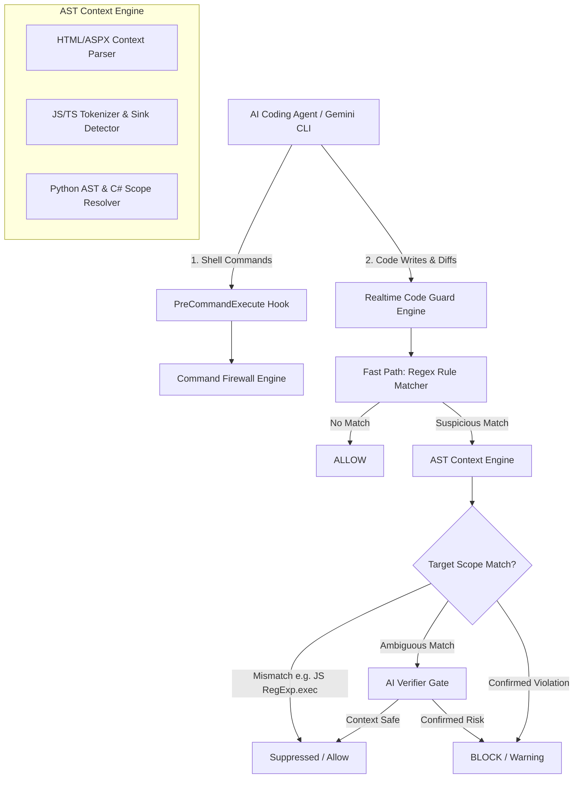

# Design Spec: Dual-Guard Realtime AST Engine & AI Verifier Integration

## Goal
Upgrade `security-sast-guard` into a real-time monitoring and security enforcement guard for AI coding agents. Combine AST Context-Aware Scoping with AI Verifier Gate to detect, classify, and block security vulnerabilities (RCE, XSS, Deserialization) with zero false positives.

---

## Architecture Overview

---

## Detailed Components

### 1. `ASTContextEngine` (`src/domain/ast_context_engine.py`)
- **`HTMLASPXContextParser`**:
  - Uses lightweight `html.parser` to categorize nodes into: `html-attribute` (`src=`, `href=`), `html-inline-event` (`onclick=`, `onerror=`), and `html-template-expr` (`<%= %>`).
- **`JSContextTokenizer`**:
  - Tokenizes JS/TS lines to distinguish builtin method calls (`RegExp.prototype.exec()`) from dangerous execution sinks (`eval()`, `new Function()`, `innerHTML =`).
- **`ServerContextParser`**:
  - Uses Python `ast` module and C# block heuristics to resolve `server-code` vs `client-code` execution boundaries.

### 2. Scoped Ruleset Schema (`rules/sast_rules.json`)
Every rule supports explicit context targeting:
- `target_scopes`: Array of node scopes where the rule is active (e.g. `["html-inline-event"]`, `["server-code"]`).
- `excluded_scopes`: Array of node scopes where the rule is ignored (e.g. `["client-js-regex"]`).

### 3. Dynamic AI Verifier Gate (`src/domain/ai_verifier.py`)
- For findings flagged as ambiguous by `ASTContextEngine`, the scanner extracts a 10-line surrounding code window and queries `AIVerifier` to verify taint safety and sanitizer presence (`HttpUtility.JavaScriptStringEncode`, `DOMPurify`, `HttpUtility.HtmlEncode`).

---

## Implementation & Testing Strategy

1. **Unit Tests**: Add tests in `tests/test_ast_context_engine.py` verifying HTML tag parsing, JS token classification, and rule scope filtering.
2. **Integration Verification**: Ensure complete compatibility with `sast_scan_file`, `sast_scan_diff`, and PreCommandExecute firewall hook.
