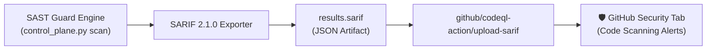
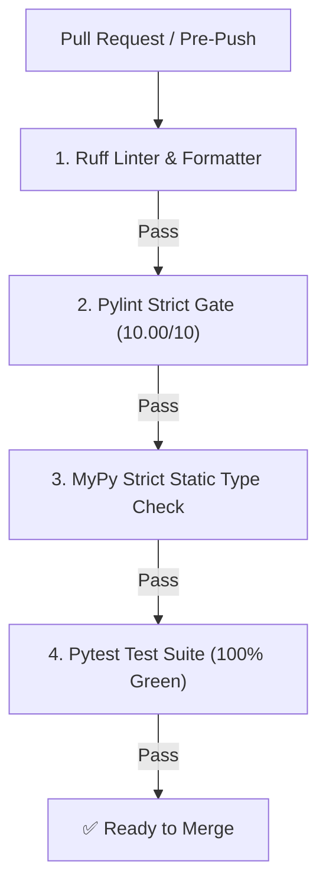
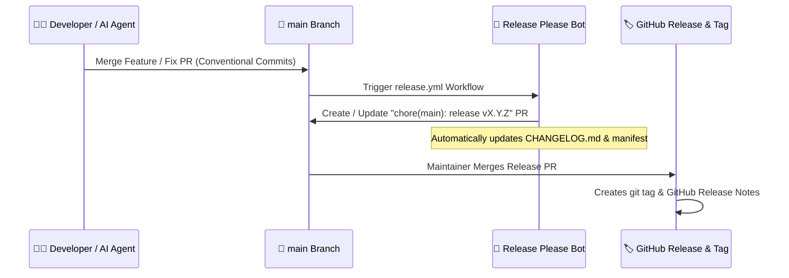

# 🔄 CI/CD Quality Gates, SARIF 2.1.0 & Release Please

This document specifies the software quality assurance framework, **ISO SARIF 2.1.0** export for **GitHub Advanced Security**, the **4 mandatory CI Quality Gates**, the **Conventional Commits** standard, and automated version releases via **Google Release Please v4**.

---

## 📊 1. ISO SARIF 2.1.0 Publication & GitHub Security Integration

Security SAST Guard exports analysis reports adhering to the standard **SARIF (Static Analysis Results Interchange Format) version 2.1.0**, natively supported by GitHub Code Scanning, SonarQube, Azure DevOps, and GitLab.



### 1.1. SARIF Report Structure & Telemetry

The generated `.sarif` file incorporates deep vulnerability telemetry:
- **Taxonomy Tags**: Complete mappings for **CWE IDs** (`CWE-79`, `CWE-89`) and **OWASP Top 10** categories (`A03:2021-Injection`).
- **Semantic Fingerprints**: Location-agnostic SHA-256 signatures to track issue lifecycles across refactorings without breaking issue history.
- **`codeFlows` & `threadFlows`**: Step-by-step dataflow propagation graph from Source to Sink.

### 1.2. GitHub Actions Integration Workflow (`.github/workflows/ci.yml`)

```yaml
name: CI & SAST Security Gate

on:
  push:
    branches: [ main ]
  pull_request:
    branches: [ main ]

jobs:
  sast-scan:
    name: Run SAST Guard & Upload SARIF
    runs-on: ubuntu-latest
    steps:
      - name: Checkout Code
        uses: actions/checkout@v4

      - name: Set up Python
        uses: actions/setup-python@v5
        with:
          python-version: "3.12"

      - name: Install Dependencies
        run: |
          pip install -e .

      - name: Execute SAST Scan & Generate SARIF
        run: |
          python control_plane.py scan . --format sarif --sarif results.sarif

      - name: Upload SARIF to GitHub Security
        uses: github/codeql-action/upload-sarif@v3
        if: always()
        with:
          sarif_file: results.sarif
```

---

## 🧪 2. Four Mandatory CI Quality Gates

Every Pull Request must pass all 4 automated Quality Gates with **Zero Errors** before merging into `main`:



### 2.1. Local Quality Verification Commands

Execute the following quality commands in your local workspace:

```bash
# 1. Linting & code style formatting (Ruff)
python -m ruff check .
python -m ruff format --check .

# 2. Strict code quality analysis (Pylint 10.00/10 required)
python -m pylint control_plane.py src/

# 3. Static type analysis (MyPy Strict Mode)
python -m mypy --config-file=pyproject.toml control_plane.py src/

# 4. Automated unit & integration tests (Pytest)
python -m pytest
```

---

## 📜 3. Conventional Commits & Atomic Scope Policy

The repository strictly enforces **Conventional Commits v1.0.0** formatting:

### 3.1. Commit Message Structure

```text
<type>(<scope>): <concise description> (Fixes #<issue_id>)
```

### 3.2. Commit Types & SemVer Impact

| Type | Semantic Meaning & Usage | Version Increment (SemVer) |
| :--- | :--- | :---: |
| **`feat`** | **ONLY** for new features in core engine or scanners | **Minor** (`v1.1.0` $\to$ `v1.2.0`) |
| **`fix`** | Bug fixes in engine logic, normalizer, or rules | **Patch** (`v1.1.0` $\to$ `v1.1.1`) |
| **`refactor`** | Internal code restructuring without behavioral changes | **Patch** (`v1.1.0` $\to$ `v1.1.1`) |
| **`chore`** | Maintenance, dependencies upgrade, CI/CD updates | **Patch** (`v1.1.0` $\to$ `v1.1.1`) |
| **`docs`** | Documentation additions or modifications (`.md`, docstrings) | *No version bump* |
| **`style`** | Code style formatting, whitespace corrections | *No version bump* |
| **`test`** | Unit or integration test additions / fixes | *No version bump* |

### 3.3. Atomic Commits per Issue Rule

- **No Multi-Issue Bundling**: Every GitHub issue must be resolved in an isolated commit (1 Issue = 1 Commit).
- **Issue Reference Keyword**: Always append `Fixes #<id>` or `Closes #<id>` to link and close the issue automatically upon PR merge.

---

## 🚀 4. Automated Release Management with Release Please v4

The project uses **Google Release Please v4** to automate Semantic Versioning releases, changelog compilation, and GitHub releases.



### 4.1. Release Please Configuration Files

- **`release-please-config.json`**: Configures package type (`python`), changelog sections, and release strategy.
- **`.release-please-manifest.json`**: Tracks the current semantic version of the repository.

> [!CAUTION]
> **Never run manual `git tag` or edit versions in `plugin.json` / `pyproject.toml` manually.** Manual tagging desynchronizes the release manifest and causes version downgrade errors in CI/CD.
