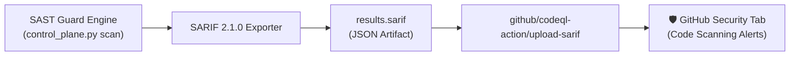
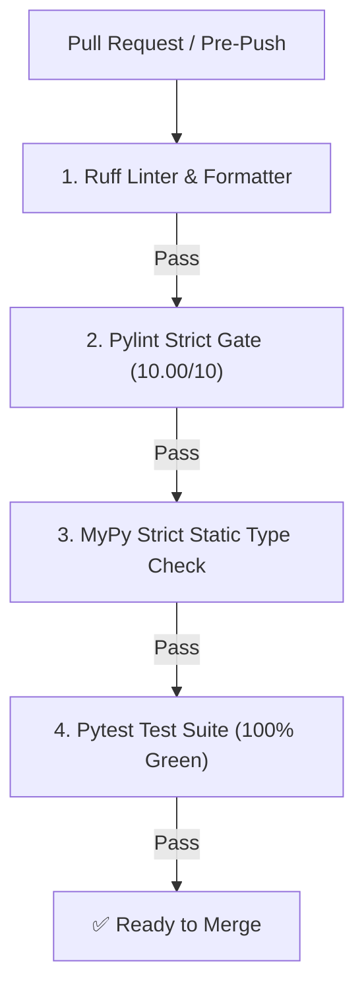
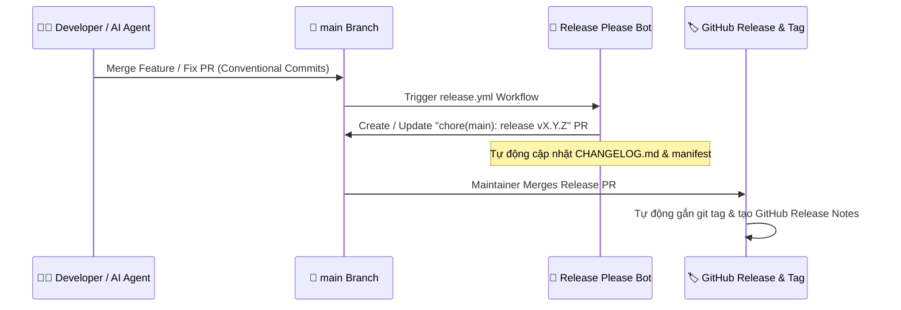

# 🔄 CI/CD Quality Gates, SARIF & Quy Trình Phát Triển

Tài liệu này đặc tả quy trình đảm bảo chất lượng phần mềm (Quality Assurance), tích hợp định dạng xuất bản quốc tế **ISO SARIF 2.1.0** vào **GitHub Advanced Security**, bộ **4 CI Quality Gates** bắt buộc, quy chuẩn commit **Conventional Commits** và hệ thống phát hành tự động **Release Please v4**.

---

## 📊 1. Xuất Bản SARIF 2.1.0 & Tích Hợp GitHub Advanced Security

Security SAST Guard xuất bản báo cáo theo định dạng chuẩn **SARIF (Static Analysis Results Interchange Format) phiên bản 2.1.0**, được hỗ trợ native bởi GitHub Code Scanning, SonarQube, Azure DevOps và GitLab.



### 1.1. Cấu Trúc Báo Cáo SARIF của SAST Guard

File `.sarif` chứa đầy đủ siêu dữ liệu phân loại và đường đi lan truyền:
- **Taxonomy Tags**: Ánh xạ rõ ràng mã định danh CWE (như `CWE-79`, `CWE-89`) và OWASP Top 10 (`A03:2021-Injection`).
- **Semantic Fingerprints**: Mã băm SHA-256 vị trí độc lập giúp theo dõi trạng thái của lỗ hổng xuyên suốt các commit mà không bị mất dấu khi số dòng code thay đổi.
- **`codeFlows` & `threadFlows`**: Biểu diễn từng bước dữ liệu di chuyển từ Source đến Sink.

### 1.2. Mẫu Cấu Hình GitHub Actions (`.github/workflows/ci.yml`)

```yaml
name: CI & SAST Security Gate

on:
  push:
    branches: [ main ]
  pull_request:
    branches: [ main ]

jobs:
  sast-scan:
    name: Run SAST Guard & Upload SARIF
    runs-on: ubuntu-latest
    steps:
      - name: Checkout Code
        uses: actions/checkout@v4

      - name: Set up Python
        uses: actions/setup-python@v5
        with:
          python-version: "3.12"

      - name: Install Dependencies
        run: |
          pip install -e .

      - name: Execute SAST Scan & Generate SARIF
        run: |
          python control_plane.py scan . --format sarif --sarif results.sarif

      - name: Upload SARIF to GitHub Security
        uses: github/codeql-action/upload-sarif@v3
        if: always()
        with:
          sarif_file: results.sarif
```

---

## 🧪 2. Bộ 4 CI Quality Gates Bắt Buộc

Mọi đóng góp mã nguồn (Pull Request) trước khi được merge vào nhánh chính `main` **BẮT BUỘC** phải vượt qua 100% bộ 4 bài kiểm tra sau với kết quả Zero Errors:



### 2.1. Lệnh Kiểm Tra Cục Bộ (Run Locally)

Lập trình viên và AI Agent phải chạy chuỗi lệnh sau trong terminal trước khi commit:

```bash
# 1. Kiểm tra linter và định dạng mã nguồn (Ruff)
python -m ruff check .
python -m ruff format --check .

# 2. Kiểm tra chuẩn chất lượng Pylint nghiêm ngặt (Yêu cầu điểm số 10.00/10)
python -m pylint control_plane.py src/

# 3. Kiểm tra kiểu tĩnh nghiêm ngặt (MyPy Strict Mode)
python -m mypy --config-file=pyproject.toml control_plane.py src/

# 4. Chạy toàn bộ bộ kiểm thử tự động (Pytest)
python -m pytest
```

---

## 📜 3. Quy Chuẩn Commit (Conventional Commits) & Cam Kết Nguyên Tử

Dự án áp dụng chặt chẽ chuẩn **Conventional Commits v1.0.0** kết hợp định danh phạm vi (**Scope**):

### 3.1. Cú Pháp Commit Message

```text
<type>(<scope>): <mô tả ngắn gọn bằng tiếng Anh/Việt> (Fixes #<issue_id>)
```

### 3.2. Bảng Phân Loại Commit Types

| Type | Ý Nghĩa Sử Dụng | Mức Độ Tăng Phiên Bản (SemVer) |
| :--- | :--- | :---: |
| **`feat`** | **CHỈ DÙNG** khi thêm tính năng mới vào mã nguồn lõi hoặc mở rộng khả năng quét | **Minor** (`v1.1.0` $\to$ `v1.2.0`) |
| **`fix`** | Sửa lỗi (bug fix) trong mã nguồn, logic giải mã, hoặc sai sót trong rule | **Patch** (`v1.1.0` $\to$ `v1.1.1`) |
| **`refactor`** | Tái cấu trúc mã nguồn mà không thay đổi hành vi bên ngoài | **Patch** (`v1.1.0` $\to$ `v1.1.1`) |
| **`chore`** | Tác vụ bảo trì, nâng cấp dependencies, cập nhật cấu hình CI/CD | **Patch** (`v1.1.0` $\to$ `v1.1.1`) |
| **`docs`** | Thêm mới hoặc chỉnh sửa tài liệu (`.md`, docstrings, wiki) | *Không tăng phiên bản* |
| **`style`** | Sửa khoảng trắng, formatting mà không ảnh hưởng tới code | *Không tăng phiên bản* |
| **`test`** | Thêm mới hoặc chỉnh sửa unit/integration tests | *Không tăng phiên bản* |

### 3.3. Quy Tắc Cam Kết Nguyên Tử Cho Từng Issue (Atomic Commits per Issue)

- **Tuyệt đối KHÔNG gộp nhiều Issue**: Mỗi issue trên GitHub phải được giải quyết trong 1 commit độc lập (1 Issue = 1 Commit).
- **Liên kết từ khóa đóng Issue**: Bắt buộc kèm `Fixes #<id>` hoặc `Closes #<id>` ở cuối tiêu đề hoặc phần thân commit (Ví dụ: `fix(firewall): strip shell wrapper prefixes (Fixes #176)`).

---

## 🚀 4. Tự Động Quản Lý Phiên Bản Với Release Please v4

Repository sử dụng **Google Release Please v4** để tự động hóa toàn bộ vòng đời phát hành phần mềm theo chuẩn **Semantic Versioning (SemVer)**.



### 4.1. Cấu Hình Release Please

Hệ thống được điều khiển bởi hai tệp cấu hình tại thư mục gốc:
- **`release-please-config.json`**: Cấu hình package name, release type (`python`), và chiến lược changelog.
- **`.release-please-manifest.json`**: Theo dõi phiên bản hiện hành của dự án.

> [!CAUTION]
> **Tuyệt đối KHÔNG tự ý chạy lệnh `git tag` hoặc chỉnh sửa thủ công version** trong `plugin.json` / `pyproject.toml`. Việc này sẽ làm sai lệch manifest của bot và gây lỗi downgrade version trong chu trình CI/CD.
