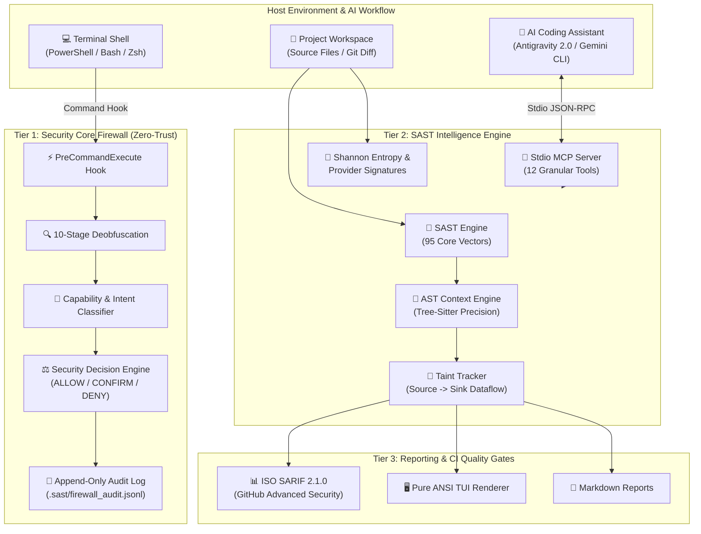

# 🛡️ Security SAST Guard — Enterprise Wiki

Chào mừng bạn đến với trung tâm tài liệu kỹ thuật chính thức của **Security SAST Guard** — Hệ thống phân tích bảo mật tĩnh (SAST) thời gian thực và Tường lửa Thực thi Lệnh (Command Interception Firewall) chuẩn **Zero-Trust**, được thiết kế đặc thù cho các Trợ lý Lập trình AI (**Google Antigravity 2.0**, **Gemini CLI**) và các chu trình phát triển phần mềm hiện đại.

---

## 🌟 Tổng Quan Hệ Thống (System Overview)

Trong kỷ nguyên phát triển phần mềm với sự tham gia của AI Agents, các lỗ hổng bảo mật không chỉ phát sinh từ mã nguồn (Source Code) mà còn tiềm ẩn nguy cơ nghiêm trọng từ việc AI Agent tự động thực thi các lệnh Shell nguy hiểm, tải mã độc từ xa (`Download+Execute`), hoặc vượt quyền bảo mật (`ExecutionPolicy Bypass`).

**Security SAST Guard** thiết lập mô hình phòng thủ cộng sinh 2 lớp (**Symbiotic Two-Tier Defense Architecture**):

1. **Lớp 1: Background Command Firewall (PreCommandExecute Hook)**:
   - Chặn và kiểm toán mọi lệnh terminal trước khi được đưa vào shell execution loop.
   - Chuỗi chuẩn hóa và giải mã 10 tầng (**10-Stage Deobfuscation Normalizer**).
   - Phân loại quyền hạn (7 Capability Groups) và nhận diện ý đồ tấn công (Threat Intent Reasoning).
   - Hệ thống quyết định 4 trạng thái (**4-State Decision Machine**) và ghi log bất biến (`.sast/firewall_audit.jsonl`).
2. **Lớp 2: Stdio SAST Intelligence Server (12 Granular Tools)**:
   - Cung cấp giao thức **Model Context Protocol (MCP)** qua Stdio cho phép AI Agent trực tiếp tra cứu an ninh, quét taint trace, kiểm tra dataflow từ Source đến Sink.
   - Động cơ phân tích AST đa ngôn ngữ (Tree-Sitter Structural Context) giúp phân biệt chính xác ngữ cảnh Client-side vs Server-side.
   - 95 vector quy tắc bảo mật bao phủ toàn diện **OWASP Top 10**, **OWASP API Top 10**, **OWASP LLM 2025**, **CWE Top 25** và **CI/CD Security**.
   - Bộ dò tìm bí mật **Shannon Entropy** kết hợp nhận diện chữ ký API Token của các nhà cung cấp lớn (OpenAI, Anthropic, GitHub, AWS, Stripe...).



---

## ⚡ Hướng Dẫn Cài Đặt Nhanh (1-Click Quick Start)

### 1. Môi trường Windows (PowerShell)

Mở PowerShell với quyền người dùng hiện tại và chạy:

```powershell
# Tải và chạy bộ cài đặt tự động
Invoke-WebRequest -Uri "https://raw.githubusercontent.com/nguyenduydan/security-sast-guard-plugin/main/install.ps1" -OutFile "install.ps1"
.\install.ps1

# Cập nhật plugin (Bảo toàn cấu hình .sast/profile.json của dự án)
cd $HOME\.gemini\config\plugins\security-sast-guard; .\update.ps1

# Gỡ bỏ hoàn toàn plugin
cd $HOME\.gemini\config\plugins\security-sast-guard; .\remove.ps1
```

### 2. Môi trường Linux & macOS (POSIX Bash/Zsh)

Mở terminal và thực thi lệnh:

```bash
# Tải và chạy bộ cài đặt tự động
curl -fsSL https://raw.githubusercontent.com/nguyenduydan/security-sast-guard-plugin/main/install.sh -o install.sh
chmod +x install.sh && ./install.sh

# Cập nhật plugin (Bảo toàn cấu hình .sast/profile.json)
cd ~/.gemini/config/plugins/security-sast-guard && ./update.sh

# Gỡ bỏ hoàn toàn plugin
cd ~/.gemini/config/plugins/security-sast-guard && ./remove.sh
```

---

## 📚 Danh Mục Chuyên Đề Wiki (Documentation Index)

Bộ Wiki kỹ thuật bao gồm 5 chuyên đề chuyên sâu giúp bạn nắm vững mọi khía cạnh của hệ thống:

| STT | Chuyên Đề | Tóm Tắt Nội Dung | Liên Kết |
| :---: | :--- | :--- | :---: |
| 1 | **Kiến Trúc & Mô Hình Zero-Trust** | Chi tiết 10-Stage Deobfuscation, Capability/Intent reasoning, Threat Chains, AST Precision Engine, Taint Tracking & Shannon Entropy Detector. | [Xem chi tiết](Architecture-and-Security-Model.md) |
| 2 | **CLI & Slash Commands** | Hướng dẫn sử dụng 8 Slash Commands cho AI Agent, toàn bộ cú pháp CLI `sast`, flags mở rộng và cấu hình Blacklist / `.sastignore`. | [Xem chi tiết](CLI-and-Slash-Commands.md) |
| 3 | **Tích Hợp Stdio MCP Server** | Hướng dẫn 12 Stdio MCP Tools (kèm schema chi tiết) và cách tích hợp vào Antigravity 2.0, Gemini CLI, Claude Desktop, Cursor. | [Xem chi tiết](MCP-Server-Integration.md) |
| 4 | **Rule Engine & Security Taxonomy** | Ma trận 95 vector quy tắc, ánh xạ CWE/OWASP/NIST, cú pháp inline `# sast-ignore`, và quy trình đồng bộ Markdown sang JSON. | [Xem chi tiết](Rule-Engine-and-Taxonomy.md) |
| 5 | **CI/CD & Quality Gates** | Tích hợp SARIF 2.1.0 vào GitHub Code Scanning, bộ 4 Quality Gates (Ruff, Pylint 10/10, MyPy, Pytest), Git Flow & Release Please v4. | [Xem chi tiết](CI-CD-and-Quality-Gates.md) |

---

## 🧩 Yêu Cầu Hệ Thống (System Requirements)

- **Python Runtime**: Python 3.10+ (Khuyến nghị 3.12 hoặc 3.14).
- **Hệ điều hành hỗ trợ**: Windows 10/11, Windows Server, Ubuntu 20.04+, Debian 11+, macOS Sonoma / Sequoia.
- **Hệ sinh thái AI Tương thích**:
  - Google Antigravity 2.0 (Native Plugin & MCP)
  - Gemini CLI Ecosystem
  - Claude Desktop / Cursor IDE (qua giao thức Model Context Protocol Stdio)
