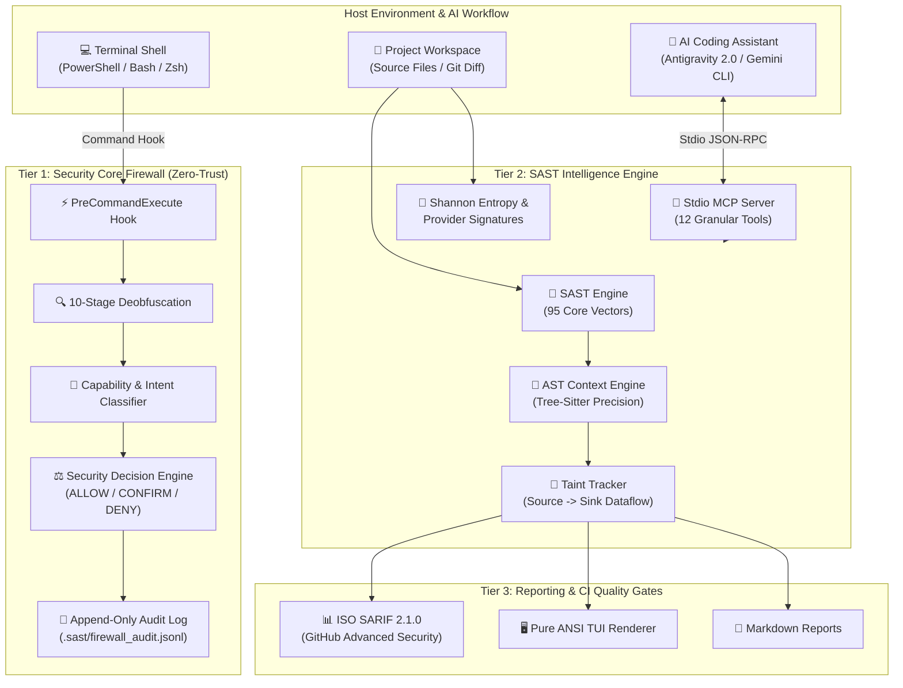

# 🛡️ Security SAST Guard — Enterprise Wiki

Welcome to the official technical documentation hub for **Security SAST Guard** — an enterprise-grade, real-time Static Application Security Testing (SAST) and **Zero-Trust Command Interception Firewall** engine engineered specifically for AI Coding Assistants (**Google Antigravity 2.0**, **Gemini CLI**) and modern autonomous agent workflows.

---

## 🌟 System Overview

In the era of AI-assisted software engineering, security vulnerabilities stem not only from source code flaws but also from autonomous agent execution risks, such as accidental execution of destructive shell commands, unverified remote downloads (`Download+Execute`), or privilege bypass attacks (`ExecutionPolicy Bypass`).

**Security SAST Guard** establishes a symbiotic two-tier defense architecture:

1. **Tier 1: Background Command Interception Firewall (`PreCommandExecute` Hook)**:
   - Synchronously intercepts and inspects every terminal command before execution in the shell.
   - Executes a comprehensive **10-Stage Deobfuscation Normalizer** to defeat evasion techniques.
   - Performs semantic capability classification (7 groups) and threat intent reasoning.
   - Evaluates commands against a formal **4-State Decision Machine** and logs immutable audit records (`.sast/firewall_audit.jsonl`).
2. **Tier 2: Stdio SAST Intelligence Server (12 Granular Tools)**:
   - Implements the **Model Context Protocol (MCP)** over Stdio, empowering AI agents to perform proactive security audits, taint tracking, and dataflow graph inspection.
   - Features a multi-language AST precision engine (`tree-sitter`) that distinguishes client-side DOM interactions from server-side execution sinks.
   - Implements **95 core security vector rules** covering **OWASP Top 10**, **OWASP API Top 10**, **OWASP LLM Top 10 (2025)**, **CWE Top 25**, and **CI/CD Security**.
   - Integrates a high-precision **Shannon Entropy Secret Detector** combined with provider token signatures (OpenAI, Anthropic, GitHub, AWS, Stripe, Slack, and private keys).



---

## ⚡ 1-Click Quick Start

### 1. Windows (PowerShell)

Open PowerShell with standard user privileges and run:

```powershell
# Download and run the automated installer
Invoke-WebRequest -Uri "https://raw.githubusercontent.com/nguyenduydan/security-sast-guard-plugin/main/install.ps1" -OutFile "install.ps1"
.\install.ps1

# Update the plugin (Preserves local .sast/profile.json configuration)
cd $HOME\.gemini\config\plugins\security-sast-guard; .\update.ps1

# Completely remove the plugin
cd $HOME\.gemini\config\plugins\security-sast-guard; .\remove.ps1
```

### 2. Linux & macOS (POSIX Bash/Zsh)

Open terminal and execute:

```bash
# Download and run the automated installer
curl -fsSL https://raw.githubusercontent.com/nguyenduydan/security-sast-guard-plugin/main/install.sh -o install.sh
chmod +x install.sh && ./install.sh

# Update the plugin (Preserves local .sast/profile.json configuration)
cd ~/.gemini/config/plugins/security-sast-guard && ./update.sh

# Completely remove the plugin
cd ~/.gemini/config/plugins/security-sast-guard && ./remove.sh
```

---

## 📚 Technical Wiki Index

Explore our comprehensive technical guides for complete architectural and operational mastery:

| Section | Topic | Core Contents & Focus Areas | Direct Link |
| :---: | :--- | :--- | :---: |
| 1 | **Architecture & Zero-Trust Defense** | 10-Stage Deobfuscation, Capability/Intent reasoning, Threat Chains, AST Precision Engine, Taint Tracking & Shannon Entropy Detector. | [Read Guide](Architecture-and-Security-Model.md) |
| 2 | **CLI & Slash Commands Reference** | Complete guide for 8 AI Agent Slash Commands, CLI commands syntax, extended flags, and Blacklist / `.sastignore` management. | [Read Guide](CLI-and-Slash-Commands.md) |
| 3 | **Stdio MCP Server Integration** | 12 Stdio MCP Tools specification (with complete schemas) and connection guides for Antigravity 2.0, Gemini CLI, Claude Desktop, and Cursor. | [Read Guide](MCP-Server-Integration.md) |
| 4 | **SAST Rule Engine & Taxonomy** | 95 Security Vectors matrix, CWE/OWASP/NIST mappings, inline suppression (`# sast-ignore`), and Markdown to JSON rule synchronization. | [Read Guide](Rule-Engine-and-Taxonomy.md) |
| 5 | **CI/CD Quality Gates & Release** | ISO SARIF 2.1.0 for GitHub Code Scanning, 4 mandatory Quality Gates (Ruff, Pylint 10/10, MyPy, Pytest), Git Flow & Release Please v4. | [Read Guide](CI-CD-and-Quality-Gates.md) |

---

## 🧩 System Requirements

- **Python Runtime**: Python 3.10+ (Python 3.12 or 3.14 recommended).
- **Supported Operating Systems**: Windows 10/11, Windows Server, Ubuntu 20.04+, Debian 11+, macOS Sonoma / Sequoia.
- **Compatible AI Ecosystems**:
  - Google Antigravity 2.0 (Native Plugin & MCP)
  - Gemini CLI Ecosystem
  - Claude Desktop / Cursor IDE (via Model Context Protocol Stdio)
