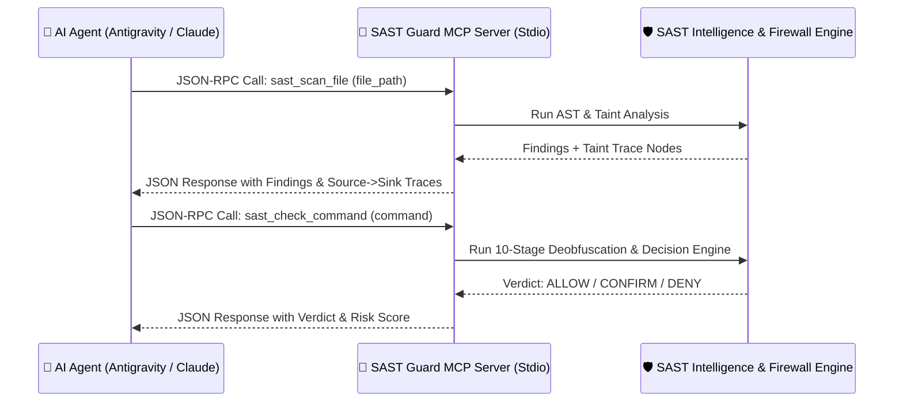

# 🔌 Tích Hợp Stdio MCP Server (12 Tools)

Tài liệu này cung cấp hướng dẫn toàn diện về máy chủ **Model Context Protocol (MCP)** dạng Stdio tích hợp trong **Security SAST Guard**, bao gồm đặc tả kỹ thuật của **12 Stdio MCP Tools** và hướng dẫn cấu hình kết nối cho các trợ lý AI phổ biến (**Google Antigravity 2.0**, **Gemini CLI**, **Claude Desktop**, **Cursor**).

---

## 🌐 1. Giới Thiệu Giao Thức Model Context Protocol (MCP)

Model Context Protocol (MCP) là chuẩn giao tiếp mở do Anthropic và cộng đồng AI phát triển, cho phép các AI Agents tương tác an toàn với các công cụ cục bộ thông qua luồng Standard Input/Output (**JSON-RPC 2.0 qua Stdio**).

Máy chủ MCP của Security SAST Guard (`python -m src.mcp.server`) cung cấp một bộ công cụ bảo mật thông minh giúp Agent chủ động kiểm tra code, truy vết rò rỉ dữ liệu (Taint Tracing), và xác thực an toàn câu lệnh shell trước khi thực thi.



---

## 🛠️ 2. Danh Mục 12 Stdio MCP Tools Chi Tiết

### 2.1. `sast_scan_file`
Thực hiện quét bảo mật chuyên sâu cho một tệp đơn lẻ, tự động trích xuất các luồng Taint Traces.

- **Input Parameters**:
  - `file_path` (*string, bắt buộc*): Đường dẫn tuyệt đối hoặc tương đối tới tệp cần kiểm tra.
- **Output Schema**:
  ```json
  {
    "status": "success",
    "findings_count": 1,
    "summary": { "Critical": 1, "High": 0, "Medium": 0, "Low": 0 },
    "findings": [
      {
        "rule_id": "OWASP-A03-SQLI",
        "rule_name": "SQL Injection Vulnerability",
        "severity": "Critical",
        "file_path": "src/controllers/user.py",
        "line_number": 42,
        "action": "Block"
      }
    ],
    "taint_traces": [
      {
        "rule_id": "OWASP-A03-SQLI",
        "source_file": "src/controllers/user.py",
        "source_line": 20,
        "sink_file": "src/controllers/user.py",
        "sink_line": 42,
        "confidence": 0.95,
        "trace_path": [
          { "file": "src/controllers/user.py", "line": 20, "symbol": "user_input", "step_type": "source" },
          { "file": "src/controllers/user.py", "line": 35, "symbol": "query_str", "step_type": "propagation" },
          { "file": "src/controllers/user.py", "line": 42, "symbol": "cursor.execute", "step_type": "sink" }
        ]
      }
    ]
  }
  ```

---

### 2.2. `sast_scan_diff`
Thực hiện quét bảo mật gia tăng (incremental) chỉ trên các dòng mã nguồn vừa được chỉnh sửa theo `git diff`.

- **Input Parameters**: Không có (Tự động phát hiện diff trong Git repository).
- **Output Schema**: Danh sách các phát hiện bảo mật và taint traces tương tự `sast_scan_file`, nhưng được thu hẹp trong phạm vi các dòng thay đổi.

---

### 2.3. `sast_check_command`
Đánh giá mức độ an toàn của một câu lệnh shell trước khi AI Agent đề xuất thực thi qua terminal.

- **Input Parameters**:
  - `command` (*string, bắt buộc*): Chuỗi lệnh terminal cần kiểm tra.
- **Output Schema**:
  ```json
  {
    "verdict": "DENY",
    "reason": "Multi-Command Threat Chain: Download+Execute detected.",
    "matched_pattern": "DOWNLOAD_EXEC_CHAIN"
  }
  ```
  *(Các giá trị `verdict` hợp lệ: `ALLOW`, `CONFIRM`, `DENY`)*.

---

### 2.4. `sast_get_status`
Truy xuất toàn bộ thông tin trạng thái hoạt động, profile và số lượng rule đang nạp.

- **Input Parameters**: Không có.
- **Output Schema**:
  ```json
  {
    "status": "success",
    "version": "1.1.0",
    "project_id": "my-secure-app",
    "stack": "python",
    "mode": "strict",
    "audit_level": "full",
    "sast_rules_count": 95,
    "deny_count": 14,
    "confirm_count": 8
  }
  ```

---

### 2.5. `sast_set_level`
Điều chỉnh mức độ sâu của bộ phân tích tĩnh theo thời gian thực.

- **Input Parameters**:
  - `level` (*string, bắt buộc*): Giá trị cho phép: `"lite"`, `"full"`, `"ultra"`.
- **Output Schema**:
  ```json
  {
    "status": "success",
    "active_level": "ultra",
    "message": "Audit level updated to 'ultra'"
  }
  ```

---

### 2.6. `sast_set_mode`
Chuyển đổi chế độ kiểm soát chính sách giữa thực thi nghiêm ngặt và ghi nhận thử nghiệm.

- **Input Parameters**:
  - `mode` (*string, bắt buộc*): Giá trị cho phép: `"strict"`, `"draft"`.
- **Output Schema**:
  ```json
  {
    "status": "success",
    "active_mode": "strict",
    "message": "Operation mode updated to 'strict'"
  }
  ```

---

### 2.7. `sast_init`
Khởi tạo file cấu hình `.sast/profile.json` cho thư mục dự án hiện hành nếu chưa tồn tại.

- **Input Parameters**: Không có.
- **Output Schema**:
  ```json
  {
    "status": "success",
    "message": "Successfully initialized project profile at .sast/profile.json",
    "profile_path": "D:/Project/.sast/profile.json"
  }
  ```

---

### 2.8. `sast_sync_rules`
Đồng bộ và biên dịch các quy tắc bảo mật dạng Markdown từ thư mục chỉ định vào `sast_rules.json`.

- **Input Parameters**:
  - `rules_dir` (*string, tùy chọn*): Thư mục chứa các tệp quy tắc `.md` (Mặc định: `rules/`).
  - `output_file` (*string, tùy chọn*): Đường dẫn tệp JSON đầu ra (Mặc định: `rules/sast_rules.json`).
- **Output Schema**:
  ```json
  {
    "status": "success",
    "message": "Synced 95 SAST rules from 'rules'.",
    "rule_count": 95,
    "target_file": "rules/sast_rules.json"
  }
  ```

---

### 2.9. `sast_get_help`
Lấy cẩm nang tra cứu nhanh danh mục lệnh slash command và bản đồ vector.

- **Input Parameters**: Không có.
- **Output Schema**: Danh sách các kỹ năng hỗ trợ và tóm tắt cú pháp.

---

### 2.10. `sast_get_dataflow_path`
Truy vấn toàn bộ đường đi lan truyền dữ liệu từ mẫu Source đến mẫu Sink trong kho mã nguồn.

- **Input Parameters**:
  - `source_pattern` (*string, bắt buộc*): Ký hiệu hoặc hàm nguồn (Ví dụ: `request.args`).
  - `sink_pattern` (*string, bắt buộc*): Ký hiệu hoặc hàm đích (Ví dụ: `cursor.execute`).
  - `repo_path` (*string, tùy chọn*): Đường dẫn thư mục quét (Mặc định: `"."`).
- **Output Schema**: Mảng các đối tượng đường dẫn chi tiết gồm danh sách file, số dòng, symbol name và step type.

---

### 2.11. `sast_get_taint_context`
Trích xuất đoạn mã ngữ cảnh xung quanh dòng bị nghi ngờ nhiễm độc (Taint line) để AI Agent phân tích sâu.

- **Input Parameters**:
  - `file_path` (*string, bắt buộc*): Đường dẫn đến tệp nguồn.
  - `line_number` (*integer, bắt buộc*): Số dòng nghi ngờ.
  - `context_lines` (*integer, tùy chọn*): Số dòng ngữ cảnh mở rộng trước và sau (Mặc định: `10`).
- **Output Schema**:
  ```json
  {
    "status": "success",
    "file": "src/api.py",
    "line": 45,
    "code_snippet": "def handle_request(req):\n    user_input = req.get('param')\n    os.system(user_input)\n",
    "taint_info": {
      "is_source": false,
      "is_sink": true,
      "flows_to": [],
      "sanitized": false
    }
  }
  ```

---

### 2.12. `sast_generate_report`
Tổng hợp các phát hiện bảo mật và phân tích nhận định của AI để xuất bản báo cáo Markdown / SARIF hoàn chỉnh.

- **Input Parameters**:
  - `findings` (*array of objects, bắt buộc*): Mảng các lỗ hổng đã phát hiện.
  - `target_path` (*string, bắt buộc*): Đường dẫn mục tiêu quét.
  - `ai_analysis` (*string, bắt buộc*): Nhận xét phân tích ngữ cảnh của AI Agent.
- **Output Schema**:
  ```json
  {
    "status": "success",
    "report_file": ".sast/reports/audit_report_2026-08-24.md",
    "summary": { "Critical": 1, "High": 2, "Medium": 0, "Low": 0 }
  }
  ```

---

## ⚙️ 3. Hướng Dẫn Cấu Hình Kết Nối Trên Các Nền Tảng

### 3.1. Google Antigravity 2.0 & Gemini CLI
Tạo hoặc bổ sung vào file `mcp_config.json` tại thư mục dự án hoặc `~/.gemini/antigravity/mcp_config.json`:

```json
{
  "mcpServers": {
    "security-sast-guard": {
      "command": "python",
      "args": ["-m", "src.mcp.server"],
      "cwd": "${workspaceFolder}"
    }
  }
}
```

### 3.2. Claude Desktop App
Thêm vào file cấu hình `claude_desktop_config.json` (Trên Windows: `%APPDATA%\Claude\claude_desktop_config.json`, trên macOS: `~/Library/Application Support/Claude/claude_desktop_config.json`):

```json
{
  "mcpServers": {
    "security-sast-guard": {
      "command": "python",
      "args": ["-m", "src.mcp.server"],
      "cwd": "D:/AI/tools/security-sast-guard"
    }
  }
}
```

### 3.3. Cursor IDE
Mở **Settings $\to$ Features $\to$ MCP Servers $\to$ Add New MCP Server**:
- **Name**: `security-sast-guard`
- **Type**: `command`
- **Command**: `python -m src.mcp.server`
- **Working Directory**: Đường dẫn đến thư mục dự án của bạn.
