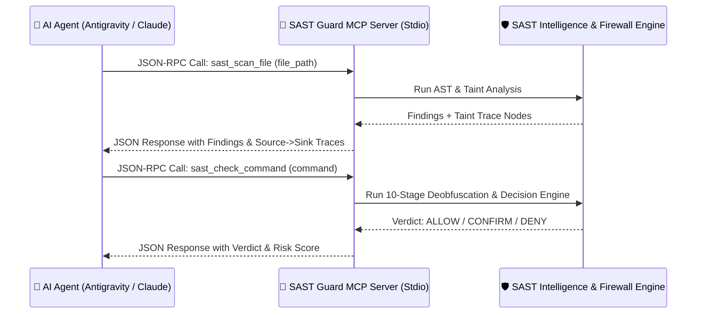

# 🔌 Stdio MCP Server Integration (12 Tools)

This document provides complete technical specifications for the **Model Context Protocol (MCP)** Stdio Server in **Security SAST Guard**, including full input/output schemas for all **12 Stdio MCP Tools** and setup instructions for major AI environments (**Google Antigravity 2.0**, **Gemini CLI**, **Claude Desktop**, and **Cursor**).

---

## 🌐 1. Model Context Protocol (MCP) Overview

The Model Context Protocol (MCP) is an open standard developed by Anthropic and the AI ecosystem that enables AI agents to securely invoke local tools via Standard Input/Output (**JSON-RPC 2.0 over Stdio**).

The Security SAST Guard MCP Server (`python -m src.mcp.server`) equips autonomous AI coding agents with real-time static security analysis, taint dataflow tracing, and command safety evaluation capabilities.



---

## 🛠️ 2. Comprehensive 12 Stdio MCP Tools Reference

### 2.1. `sast_scan_file`
Audits a single source file and extracts complete taint traces from Source to Sink.

- **Input Parameters**:
  - `file_path` (*string, required*): Absolute or relative path to the target source file.
- **Output Schema**:
  ```json
  {
    "status": "success",
    "findings_count": 1,
    "summary": { "Critical": 1, "High": 0, "Medium": 0, "Low": 0 },
    "findings": [
      {
        "rule_id": "OWASP-A03-SQLI",
        "rule_name": "SQL Injection Vulnerability",
        "severity": "Critical",
        "file_path": "src/controllers/user.py",
        "line_number": 42,
        "action": "Block"
      }
    ],
    "taint_traces": [
      {
        "rule_id": "OWASP-A03-SQLI",
        "source_file": "src/controllers/user.py",
        "source_line": 20,
        "sink_file": "src/controllers/user.py",
        "sink_line": 42,
        "confidence": 0.95,
        "trace_path": [
          { "file": "src/controllers/user.py", "line": 20, "symbol": "user_input", "step_type": "source" },
          { "file": "src/controllers/user.py", "line": 35, "symbol": "query_str", "step_type": "propagation" },
          { "file": "src/controllers/user.py", "line": 42, "symbol": "cursor.execute", "step_type": "sink" }
        ]
      }
    ]
  }
  ```

---

### 2.2. `sast_scan_diff`
Performs incremental static security analysis exclusively on modified lines identified in the active `git diff`.

- **Input Parameters**: None (Automatically inspects the local Git repository).
- **Output Schema**: Returns findings array and taint traces scoped strictly to changed lines.

---

### 2.3. `sast_check_command`
Evaluates the safety and intent of a shell command before an AI Agent proposes executing it in the terminal.

- **Input Parameters**:
  - `command` (*string, required*): The raw shell command string to evaluate.
- **Output Schema**:
  ```json
  {
    "verdict": "DENY",
    "reason": "Multi-Command Threat Chain: Download+Execute detected.",
    "matched_pattern": "DOWNLOAD_EXEC_CHAIN"
  }
  ```
  *(Valid verdicts: `ALLOW`, `CONFIRM`, `DENY`)*.

---

### 2.4. `sast_get_status`
Retrieves system telemetry, active configuration profile, and rule statistics.

- **Input Parameters**: None.
- **Output Schema**:
  ```json
  {
    "status": "success",
    "version": "1.1.0",
    "project_id": "my-secure-app",
    "stack": "python",
    "mode": "strict",
    "audit_level": "full",
    "sast_rules_count": 95,
    "deny_count": 14,
    "confirm_count": 8
  }
  ```

---

### 2.5. `sast_set_level`
Dynamically adjusts static analysis depth for the active session.

- **Input Parameters**:
  - `level` (*string, required*): Permitted values: `"lite"`, `"full"`, `"ultra"`.
- **Output Schema**:
  ```json
  {
    "status": "success",
    "active_level": "ultra",
    "message": "Audit level updated to 'ultra'"
  }
  ```

---

### 2.6. `sast_set_mode`
Switches enforcement policy strictness between blocking mode and advisory mode.

- **Input Parameters**:
  - `mode` (*string, required*): Permitted values: `"strict"`, `"draft"`.
- **Output Schema**:
  ```json
  {
    "status": "success",
    "active_mode": "strict",
    "message": "Operation mode updated to 'strict'"
  }
  ```

---

### 2.7. `sast_init`
Initializes a project-local `.sast/profile.json` security configuration in the current workspace.

- **Input Parameters**: None.
- **Output Schema**:
  ```json
  {
    "status": "success",
    "message": "Successfully initialized project profile at .sast/profile.json",
    "profile_path": "D:/Project/.sast/profile.json"
  }
  ```

---

### 2.8. `sast_sync_rules`
Compiles and synchronizes Markdown rule definitions into `sast_rules.json`.

- **Input Parameters**:
  - `rules_dir` (*string, optional*): Directory containing `.md` rules (Default: `rules/`).
  - `output_file` (*string, optional*): Destination JSON file (Default: `rules/sast_rules.json`).
- **Output Schema**:
  ```json
  {
    "status": "success",
    "message": "Synced 95 SAST rules from 'rules'.",
    "rule_count": 95,
    "target_file": "rules/sast_rules.json"
  }
  ```

---

### 2.9. `sast_get_help`
Fetches command guidance, available slash commands, and security vector mappings.

- **Input Parameters**: None.
- **Output Schema**: Structured help metadata and command definitions.

---

### 2.10. `sast_get_dataflow_path`
Queries all dataflow propagation paths connecting a specific Source pattern to a Sink pattern.

- **Input Parameters**:
  - `source_pattern` (*string, required*): Source symbol pattern (e.g., `request.args`).
  - `sink_pattern` (*string, required*): Sink symbol pattern (e.g., `cursor.execute`).
  - `repo_path` (*string, optional*): Repository root path (Default: `"."`).
- **Output Schema**: Array of structured taint flow paths with file names, line numbers, symbols, and step types.

---

### 2.11. `sast_get_taint_context`
Extracts code snippets and propagation metadata around a suspected taint line.

- **Input Parameters**:
  - `file_path` (*string, required*): Source file path.
  - `line_number` (*integer, required*): Target line number.
  - `context_lines` (*integer, optional*): Surrounding context window lines (Default: `10`).
- **Output Schema**:
  ```json
  {
    "status": "success",
    "file": "src/api.py",
    "line": 45,
    "code_snippet": "def handle_request(req):\n    user_input = req.get('param')\n    os.system(user_input)\n",
    "taint_info": {
      "is_source": false,
      "is_sink": true,
      "flows_to": [],
      "sanitized": false
    }
  }
  ```

---

### 2.12. `sast_generate_report`
Synthesizes security findings and AI analysis notes to generate complete Markdown and SARIF reports.

- **Input Parameters**:
  - `findings` (*array of objects, required*): Discovered vulnerabilities list.
  - `target_path` (*string, required*): Scanned directory or file path.
  - `ai_analysis` (*string, required*): AI agent context analysis and remediation notes.
- **Output Schema**:
  ```json
  {
    "status": "success",
    "report_file": ".sast/reports/audit_report_2026-08-24.md",
    "summary": { "Critical": 1, "High": 2, "Medium": 0, "Low": 0 }
  }
  ```

---

## ⚙️ 3. Platform Integration Configuration

### 3.1. Google Antigravity 2.0 & Gemini CLI
Add `sast-guard` to `mcp_config.json` in your project root or `~/.gemini/antigravity/mcp_config.json`:

```json
{
  "mcpServers": {
    "security-sast-guard": {
      "command": "python",
      "args": ["-m", "src.mcp.server"],
      "cwd": "${workspaceFolder}"
    }
  }
}
```

### 3.2. Claude Desktop App
Add the configuration to `claude_desktop_config.json` (Windows: `%APPDATA%\Claude\claude_desktop_config.json`, macOS: `~/Library/Application Support/Claude/claude_desktop_config.json`):

```json
{
  "mcpServers": {
    "security-sast-guard": {
      "command": "python",
      "args": ["-m", "src.mcp.server"],
      "cwd": "D:/AI/tools/security-sast-guard"
    }
  }
}
```

### 3.3. Cursor IDE
Navigate to **Settings $\to$ Features $\to$ MCP Servers $\to$ Add New MCP Server**:
- **Name**: `security-sast-guard`
- **Type**: `command`
- **Command**: `python -m src.mcp.server`
- **Working Directory**: Your project root directory.
