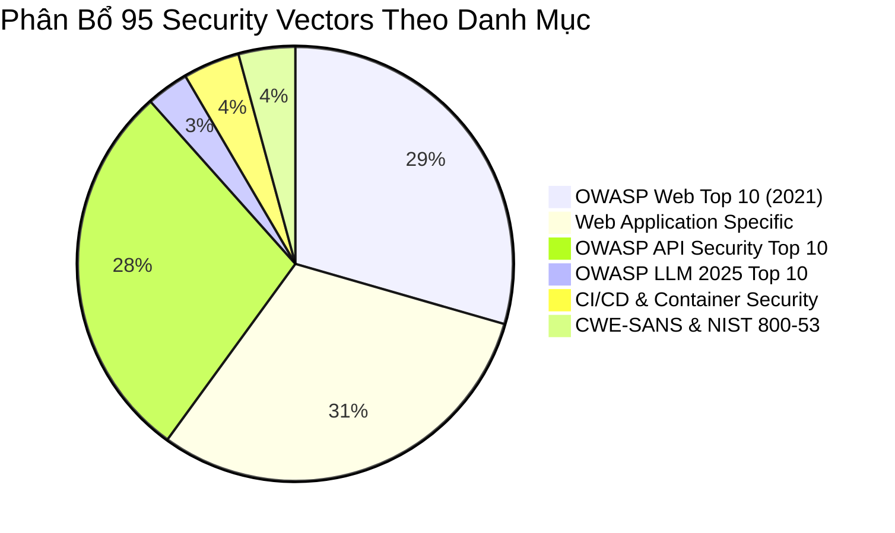
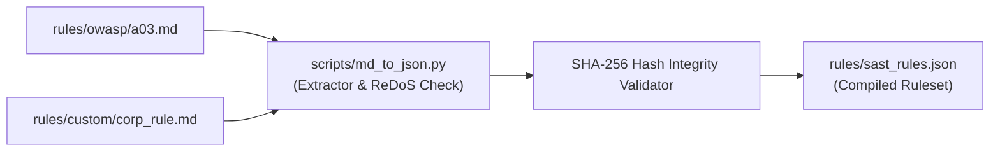

# 🛡️ Bộ Quy Tắc SAST & Phân Loại Vector Bảo Mật (Rule Engine & Taxonomy)

Tài liệu này đặc tả toàn bộ **95 Security Vectors** được triển khai trong **Security SAST Guard**, ánh xạ chi tiết theo các tiêu chuẩn quốc tế (**OWASP Top 10**, **CWE Top 25**, **OWASP LLM 2025**, **NIST SP 800-53**), hướng dẫn cú pháp bỏ qua cảnh báo (`# sast-ignore`), và quy trình đồng bộ hóa quy tắc từ Markdown sang JSON.

---

## 📊 1. Ma Trận Phân Loại 95 Security Vectors

Hệ thống quy tắc của Security SAST Guard được chia thành 6 phân nhóm chuyên biệt:



### 1.1. Chi Tiết Phân Nhóm Quy Tắc

| Phân Nhóm Danh Mục | Số Lượng | Mã OWASP / CWE Ánh Xạ | Các Vector Điển Hình & Kịch Bản Tấn Công |
| :--- | :---: | :--- | :--- |
| **OWASP Web Top 10 (2021)** | **28** | A01:2021 $\to$ A10:2021<br>CWE-79, CWE-89, CWE-502 | • **A01 Broken Access Control**: Path traversal, missing auth decorator.<br>• **A02 Cryptographic Failures**: MD5/SHA1 hashing, hardcoded DES keys.<br>• **A03 Injection**: SQL Injection (`cursor.execute(f"...")`), NoSQL injection.<br>• **A08 Deserialization RCE**: `pickle.loads()`, `yaml.unsafe_load()`. |
| **Web Application Specific** | **29** | CWE-79, CWE-94, CWE-434 | • **DOM XSS**: `dangerouslySetInnerHTML`, `innerHTML = untrusted`.<br>• **Inline Event Handlers**: `onerror=`, `onload=` in dynamic templates.<br>• **SSTI**: Jinja2 / Mako template injection (`Template(user_input)`).<br>• **Unsafe File Upload**: Unrestricted extension upload without MIME check. |
| **OWASP API Security Top 10** | **27** | API1:2023 $\to$ API10:2023<br>CWE-284, CWE-918 | • **API1 BOLA**: Object-level authorization bypass via ID tampering.<br>• **API2 Broken Auth**: Weak JWT signature validation, missing bearer token check.<br>• **API3 Mass Assignment**: Binding entire body payload to ORM model.<br>• **API7 SSRF**: `requests.get(user_supplied_url)` without whitelist. |
| **OWASP LLM Top 10 (2025)** | **3** | LLM01, LLM02, LLM06 | • **LLM01 Prompt Injection**: Unescaped user prompt concatenated to system prompt.<br>• **LLM02 Sensitive Data Disclosure**: Exposing internal credentials to LLM prompt.<br>• **LLM06 Excessive Agency**: Executing destructive tool calls without confirmation. |
| **CI/CD & Container Security** | **4** | CWE-78, CWE-250 | • **GitHub Actions Injection**: `${{ github.event.issue.body }}` in `run:` step.<br>• **Unsafe Checkout**: `actions/checkout` on untrusted fork with write token.<br>• **Docker Root Execution**: Missing `USER` instruction in Dockerfile. |
| **CWE-SANS & NIST SP 800-53** | **4** | CWE-78, CWE-22, AU-2 | • **OS Command Injection**: `os.system()`, `subprocess.call(shell=True)`.<br>• **Arbitrary File Overwrite**: Insecure `open(w)` with user-supplied filename.<br>• **Audit Failure**: Missing security logging on privileged endpoints. |

---

## 🚫 2. Cơ Chế Bỏ Qua Cảnh Báo Có Kiểm Soát (`# sast-ignore`)

Trong một số trường hợp đặc thù (như mã giả định trong test suite, hoặc trường hợp đã được xác minh an toàn tại tầng hạ tầng), lập trình viên có thể bỏ qua cảnh báo bằng cú pháp chú thích dòng:

### 2.1. Cú Pháp Chuẩn

Thêm chú thích `# sast-ignore [RULE_ID]` vào cuối dòng mã cần bỏ qua:

```python
# Bỏ qua cảnh báo SQL Injection cho câu lệnh an toàn đã qua ORM parameterization
query = f"SELECT * FROM users WHERE id = {user_id}"  # sast-ignore [OWASP-A03-SQLI]

# Bỏ qua cảnh báo mật khẩu giả định trong file mock test
TEST_DUMMY_TOKEN = "sk-proj-testdummy123456789012345678901234567890"  # sast-ignore [TOKEN_OPENAI]
```

### 2.2. Kiểm Toán Bỏ Qua Minh Bạch (Transparency Audit)

Hệ thống ghi nhận toàn bộ các dòng mã sử dụng `# sast-ignore` vào báo cáo kiểm toán, ngăn chặn việc lạm dụng hoặc che giấu vi phạm:
- Số lượng suppressions được thống kê riêng trong phần tóm tắt báo cáo.
- Nếu một rule `Critical` bị ignore không có lý do hợp lệ trong chế độ `strict`, hệ thống vẫn đánh dấu cờ cảnh báo rà soát.

---

## 📝 3. Định Dạng Quy Tắc Dạng Markdown & Quy Trình Đồng Bộ

Security SAST Guard áp dụng triết lý **"Rules as Documentation"** — các quy tắc bảo mật được viết dưới dạng tệp tài liệu Markdown (`.md`) dễ đọc, có thể thảo luận và review qua Git Pull Request, sau đó được tự động biên dịch thành file JSON tối ưu cho Scanner.

### 3.1. Cấu Trúc File Quy Tắc Markdown Mẫu (`RULE_TEMPLATE.md`)

```markdown
# SAST Rule Specification

## [OWASP-A03-SQLI] SQL Injection Vulnerability

**Category:** Web Application Security  
**Severity:** 🔴 Critical  
**Action:** Block  
**CWE:** CWE-89  
**OWASP:** A03:2021-Injection  

### Description
Phát hiện các câu truy vấn SQL được xây dựng bằng cách nối chuỗi trực tiếp từ biến không an toàn thay vì sử dụng tham số hóa (Parameterized Queries).

### Detection Patterns
```regex
(?i)(?:execute|raw_sql|cursor\.execute)\s*\(\s*f["'].*?\{.*?\}
```

### Remediation Guidance
Sử dụng tham số hóa truy vấn hoặc ORM:
```python
# Không an toàn:
cursor.execute(f"SELECT * FROM users WHERE username = '{username}'")

# An toàn:
cursor.execute("SELECT * FROM users WHERE username = %s", (username,))
```
```

---

### 3.2. Quy Trình Đồng Bộ Hóa Quy Tắc (Markdown $\to$ JSON)

Để biên dịch toàn bộ các file `.md` trong thư mục `rules/` thành `rules/sast_rules.json`:

```bash
# Chạy script đồng bộ qua Python CLI
python -m scripts.md_to_json --source rules/ --target rules/sast_rules.json

# Hoặc thông qua Slash Command trong AI Agent
/sast-rules sync
```



---

## 🔒 4. Kiểm Tra Tính Toàn Vẹn & Chống Tấn Công ReDoS

1. **SHA-256 Checksum Verification**: Khi nạp tập quy tắc `sast_rules.json`, hệ thống so sánh mã băm SHA-256 với bảng băm lưu trong bộ nhớ. Bất kỳ sự sửa đổi trái phép nào từ bên ngoài đều bị từ chối (`IntegrityViolationError`).
2. **ReDoS Catastrophic Backtracking Protection**: Mỗi mẫu regex trước khi được đăng ký đều được kiểm tra độ phức tạp thời gian nhằm tránh các lỗi biểu thức chính quy dạng `(a+)+$` có thể làm cạn kiệt tài nguyên CPU của máy chủ.
