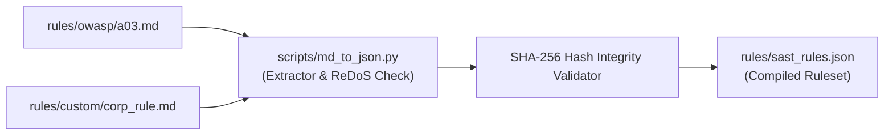

# 🛡️ SAST Rule Engine & Security Vectors Taxonomy

This document specifies the **95 Security Vectors** implemented within **Security SAST Guard**, detailed mappings across international security frameworks (**OWASP Top 10**, **CWE Top 25**, **OWASP LLM 2025**, **NIST SP 800-53**), controlled inline suppression syntax (`# sast-ignore`), and Markdown to JSON rule synchronization.

---

## 📊 1. Security Vectors Taxonomy Matrix (95 Rules)

Security SAST Guard categorizes security rules into 6 specialized domains:


### 1.1. Detailed Rule Categories & Vector Breakdown

| Category | Rule Count | Standards Mapping | Core Vectors & Attack Scenarios |
| :--- | :---: | :--- | :--- |
| **OWASP Web Top 10 (2021)** | **28** | A01:2021 $\to$ A10:2021<br>CWE-79, CWE-89, CWE-502 | • **A01 Broken Access Control**: Path traversal, missing authentication decorators.<br>• **A02 Cryptographic Failures**: MD5/SHA1 hashing, hardcoded DES keys.<br>• **A03 Injection**: SQL Injection (`cursor.execute(f"...")`), NoSQL injection.<br>• **A08 Deserialization RCE**: Insecure `pickle.loads()`, `yaml.unsafe_load()`. |
| **Web Application Specific** | **29** | CWE-79, CWE-94, CWE-434 | • **DOM XSS**: Insecure `dangerouslySetInnerHTML`, `innerHTML = untrusted`.<br>• **Inline Event Handlers**: Dynamic `onerror=`, `onload=` in HTML templates.<br>• **SSTI**: Jinja2 / Mako server-side template injection (`Template(user_input)`).<br>• **Unsafe File Upload**: Unrestricted extension upload without MIME verification. |
| **OWASP API Security Top 10** | **27** | API1:2023 $\to$ API10:2023<br>CWE-284, CWE-918 | • **API1 BOLA**: Object-level authorization bypass via ID parameter tampering.<br>• **API2 Broken Auth**: Weak JWT verification, missing bearer token checks.<br>• **API3 Mass Assignment**: Binding unfiltered request body to database ORM models.<br>• **API7 SSRF**: Unrestricted `requests.get(user_supplied_url)` outbound requests. |
| **OWASP LLM Top 10 (2025)** | **3** | LLM01, LLM02, LLM06 | • **LLM01 Prompt Injection**: Direct concatenation of user prompts into system instructions.<br>• **LLM02 Sensitive Data Disclosure**: Exposing internal credentials to LLM prompt context.<br>• **LLM06 Excessive Agency**: Executing destructive tool calls without human confirmation. |
| **CI/CD & Container Security** | **4** | CWE-78, CWE-250 | • **GitHub Actions Injection**: `${{ github.event.issue.body }}` inside `run:` step.<br>• **Unsafe Checkout**: `actions/checkout` on untrusted pull request with write tokens.<br>• **Docker Root Execution**: Missing `USER` non-root instruction in Dockerfile. |
| **CWE-SANS & NIST SP 800-53** | **4** | CWE-78, CWE-22, AU-2 | • **OS Command Injection**: `os.system()`, `subprocess.call(shell=True)`.<br>• **Arbitrary File Overwrite**: Insecure `open(w)` with user-controlled filenames.<br>• **Audit Failure**: Missing audit logs on privileged admin endpoints. |

---

## 🚫 2. Controlled Inline Suppression (`# sast-ignore`)

For verified safe exceptions (such as test fixtures, mock data, or pre-sanitized inputs), developers can suppress specific rule alerts using inline comments:

### 2.1. Standard Syntax

Append `# sast-ignore [RULE_ID]` to the target code line:

```python
# Suppress false-positive SQLi warning for pre-parameterized ORM expression
query = f"SELECT * FROM users WHERE id = {user_id}"  # sast-ignore [OWASP-A03-SQLI]

# Suppress mock token warning in test suite
TEST_DUMMY_TOKEN = "sk-proj-testdummy123456789012345678901234567890"  # sast-ignore [TOKEN_OPENAI]
```

### 2.2. Transparency & Suppression Auditability

All inline suppressions are tracked and audited to prevent unauthorized bypass:
- Total suppressed finding counts are recorded in the summary table of every report.
- In `strict` mode, suppressed `Critical` findings are flagged for administrative review.

---

## 📝 3. Rules as Documentation: Markdown to JSON Synchronization

Security SAST Guard adopts a **"Rules as Documentation"** architecture — security rules are written as human-readable Markdown (`.md`) files in `rules/`, easily reviewed via Pull Requests, and automatically compiled into `rules/sast_rules.json` for high-performance scanning.

### 3.1. Markdown Rule Specification Template (`RULE_TEMPLATE.md`)

```markdown
# SAST Rule Specification

## [OWASP-A03-SQLI] SQL Injection Vulnerability

**Category:** Web Application Security  
**Severity:** 🔴 Critical  
**Action:** Block  
**CWE:** CWE-89  
**OWASP:** A03:2021-Injection  

### Description
Detects SQL queries constructed by directly concatenating untrusted variables instead of utilizing parameterized queries or ORM abstractions.

### Detection Patterns
```regex
(?i)(?:execute|raw_sql|cursor\.execute)\s*\(\s*f["'].*?\{.*?\}
```

### Remediation Guidance
Use parameterized queries or ORM abstractions:
```python
# Insecure:
cursor.execute(f"SELECT * FROM users WHERE username = '{username}'")

# Secure:
cursor.execute("SELECT * FROM users WHERE username = %s", (username,))
```
```

---

### 3.2. Rule Compilation & Synchronization Workflow

To compile all `.md` rules into `rules/sast_rules.json`:

```bash
# Execute via Python CLI
python -m scripts.md_to_json --source rules/ --target rules/sast_rules.json

# Or execute via AI Agent Slash Command
/sast-rules sync
```



---

## 🔒 4. Rule Integrity Verification & ReDoS Protection

1. **SHA-256 Checksum Verification**: During startup, the engine computes and verifies SHA-256 hashes of `sast_rules.json` against expected signatures to detect tampering.
2. **ReDoS Catastrophic Backtracking Prevention**: Every regular expression pattern is validated before compilation to block catastrophic backtracking patterns (`(a+)+$`) that could cause denial-of-service conditions.
